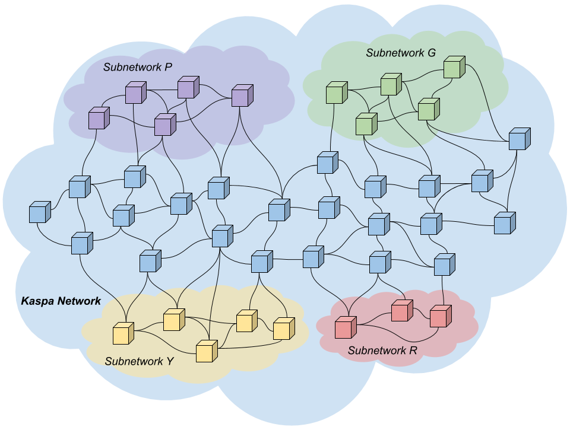
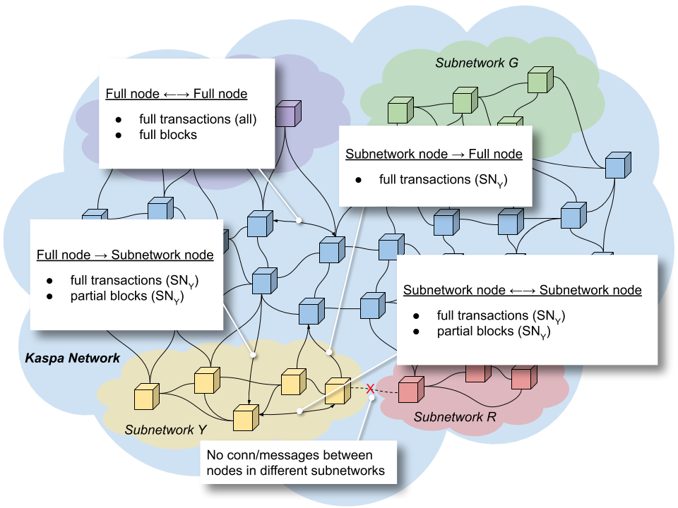

# Subnetworks

The subnetwork mechanism in Kaspa's consensus layer allows [nodes](../../../glossary.md#full-node) with a common interest to form nested networks with their own rules within the greater Kaspa network. Subnetworks allow parties to store data and run custom logic - yet, they do not force all nodes in the Kaspa network to spend network and computational resources on sending and verifying subnetwork-specific data and logic.

To enable subnetworks, Kaspa introduces three special fields inside the [transaction](../../../glossary.md#transaction):

* `subnetwork` is a 20-byte-long subnetwork ID. Think of it as a transaction type.
* `payload` is a field to store arbitrary data and code relevant to the subnetwork.
* `payloadHash` is a [hash](../../../glossary.md#hash) of the data in the field `payload`.


While `payload` is not part of the Kaspa transaction hash, `payloadHash` is, allowing uninterested nodes to ignore the payload of subnetwork transactions.


## Kaspa Reserved Subnetworks

There are three predefined subnetworks in Kaspa:

* `subnetwork 0` - Kaspa native subnetwork
* `subnetwork 1` - Kaspa coinbase subnetwork
* `subnetwork 2` - Kaspa registry subnetwork

These subnetworks' IDs are each a full 20-byte array where all bytes are zeroed except the first one, which has the value of the subnetwork \(e.g., 20 zeroes for the native subnetwork\).

### Kaspa Native Subnetwork

The Kaspa native subnetwork is used to send all native Kaspa transactions. Native Kaspa transactions do not use the payload field, and this field must be empty.

### Kaspa Coinbase Subnetwork

The Kaspa coinbase subnetwork is used for [coinbase transactions](../../../glossary.md#coinbase-transaction) - transactions that pay block rewards to miners. Read about coinbase transactions on [this page](../../../reference/transactions/coinbase-transaction.md).


Coinbase transactions are not gossiped through the network. They only appear in blocks.


### Kaspa Registry Subnetwork

The Kaspa registry subnetwork is used to create new subnetworks. In order to create and announce a new subnetwork, one needs to make a transaction on `subnetwork 2`; the resulting hash of this transaction is the subnetwork ID the newly created subnetwork. When creating the registry transaction, the `payload` field should include special instructions for the new subnetwork, such as gas limit per block.

Once a registry transaction is encountered inside the block, the subnetwork is added to the node's list of identified subnetworks. It doesn't matter if the block is eventually marked as [red](../../../glossary.md#red-block) or not.

### Gas

Gas is a measure of computation cost for subnetwork transactions. It is self claimed by the creator of each subnetwork transaction.

A gas limit is specified in the `payload` field of the registry transaction by each subnetwork's creator. It tells miners the upper bound on the sum of all transactions' gas within any block that the subnetwork is willing to process.


This agreement is in place to prevent miners from including transactions with corresponding fees that the subnetworks will not be willing nor capable to handle. Miners want to insert as many transactions to each block as possible, in order to get more fees. Subnetworks on the other hand don't want blocks to include too many transactions because each transaction involves a certain gas expenditure from running the code included in the `payload` field. Therefore the subnetworks instruct the miners to limit transactions of their subnetwork in any block according to the gas limit. If miners break this agreement, their nodes will be banned from the subnetwork.


## Subnetwork Usage

### Definitions

#### Full Nodes

Full nodes, in the subnetwork context, are nodes that listen to all transactions in the Kaspa network, including transactions of all subnetworks.

#### Partial Nodes \(Subnetwork Nodes\)

Partial nodes or subnetwork nodes are nodes interested in transactions specific to a certain subnetwork. They listen to the three predefined subnetworks 0, 1 and 2 and to the subnetwork they are interested in. Partial nodes cannot mine, because they do not have full blocks.

Partial nodes should receive [partial blocks](subnetworks-1.md#partial-block). A full block sent to a partial node will be rejected. A partial block sent to a partial node for the wrong subnetwork will also be rejected.


The Kaspa protocol requires that all nodes \(full or subnetwork\) in the P2P network transmit and validate all transactions with the predefined 0, 1 and 2 subnetworks.


#### Partial Transaction

A partial transaction is a transaction with the `payload` field zeroed.

#### Partial Block

A partial block for a given subnetwork is a block that contains regular \(full\) transactions for the given subnetwork, and partial transactions for any subnetwork other than the given subnetwork.

A partial block sent to a full node will be rejected.

Block validation is identical between full blocks and partial blocks.

### Joining the Network

When a node joins the Kaspa network, it tells its peers if it is a [full node](subnetworks-1.md#full-nodes) or a [subnetwork node](subnetworks-1.md#partial-nodes). Full nodes listen to all transactions in all subnetworks. Subnetwork nodes specify what subnetworks they are on, i.e., what transactions they want to subscribe to. For instance, a subnetwork-node might listen to 0, 1, 2 and Y.

### Who Can Connect to Whom?

Full nodes initiate connections only to full nodes, but accept connections from any node.

Subnetwork nodes initiate connections to full-nodes and to other nodes in the same subnetwork, and do not accept connections from nodes not in the same subnetwork.

### Transaction and Block Messages Between Nodes

Full nodes exchange all transactions and full blocks with other full-nodes.

Full nodes send subnetwork nodes only transactions in their subnetwork and [partial blocks](subnetworks-1.md#partial-block) tailored for their subnetwork \(containing full data for transactions in their subnetwork and [partial transactions](subnetworks-1.md#partial-transaction) for transactions not in their subnetwork\).

Subnetwork nodes send full nodes transactions from the subnetwork.

Subnetwork nodes exchange transactions and partial blocks with other subnetwork-nodes in the same subnetwork.

### Invalid Subnetwork IDs

Nodes should reject mempool transactions with subnetwork IDs that have not yet been assigned. This might happen very close to the creation of the corresponding subnetwork, but is very improbable. Nevertheless, it should be discouraged to post transactions in a just-created-subnetwork to minimize such risk.

Nodes should reject non-orphaned blocks that contain transactions with subnetwork IDs that have not yet been assigned.

## Conclusion

Subnetworks allow peers to group into application-specific clusters. Peers within those clusters exchange transactions only relevant to their application and blocks stripped of data that is redundant to them. Subnetworks are isolated from each other; all the logic and data generated in one subnetwork do not bloat other subnetworks. The subnetwork mechanism saves on network traffic and computational resources.

