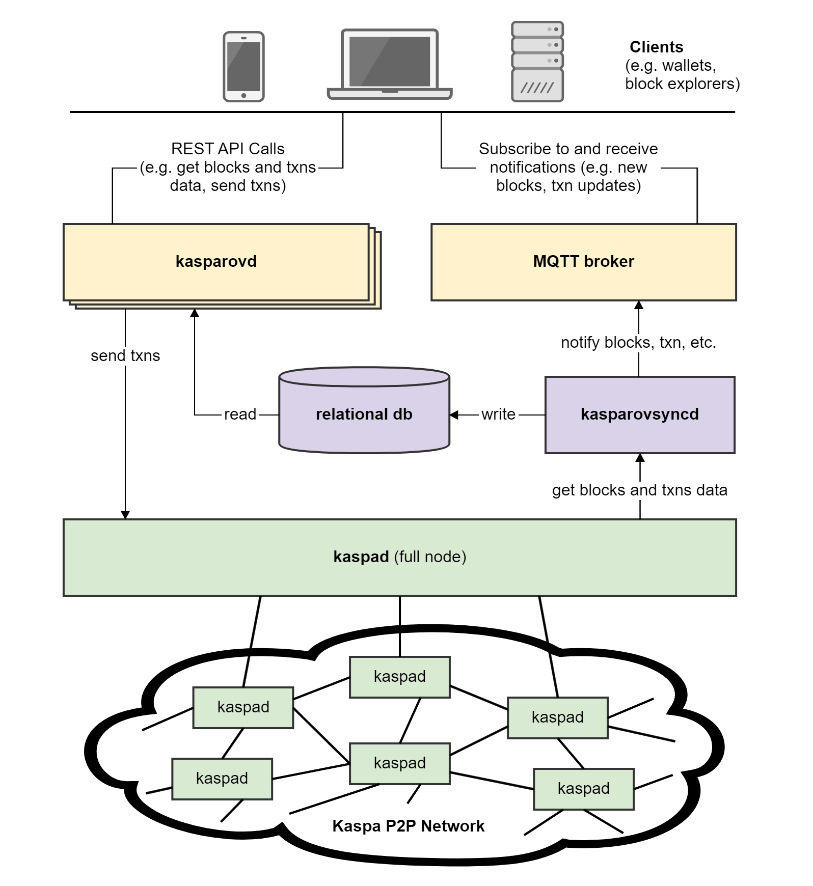

# Architecture

Kasparov is an API server for interacting with the [Kaspa network](../kaspad-full-node/reference/network/). While [Kaspa nodes](../kaspad-full-node/) handle communications internal to the Kaspa peer-to-peer network, Kasparov handles communications between the Kaspa network and the outside world.

Kasparov was designed to decouple two distinct sets of operations: a Kaspa node is very good at communicating with other nodes quickly; but it is not designed to handle frequent data queries, serve large volumes of data quickly, and handle historical data well. Kasparov can serve blocks and transactions data quickly and at large volumes, including historical data, by saving the data in a way that allows quick and efficient polling.

Kasparov is comprised of a backend data connection component \(kasparovsyncd\) and two interface components \(kasparovd and rabbitmq\). The front-facing interface components are separated so many instances of kasparovd can be run.

* **kasparovsyncd** communicates with a kaspad full node and maintains a relational database
* **kasparovd** is a [RESTful API](https://restfulapi.net/) for making queries and sending transactions
* \*\*\*\*[**rabbitmq**](https://www.rabbitmq.com/) is an [MQTT broker](https://en.wikipedia.org/wiki/MQTT#MQTT_broker) for receiving notifications

### Kasparov Sync Daemon \(kasparovsyncd\)

Kasparovsyncd is a backend component that connects to a kaspad node, reads block and transaction data from the Kaspa network through the node, and syncs it to a relational database.

Kasparovsyncd currently uses MySQL; however, there is an active issue to allow it to run with PostgreSQL and MariaDB.

### Kasparov RESTful API \(kasparovd\)

Kasparovd is a RESTful API providing endpoints for sending http requests, such as querying for blocks, transactions, and addresses, and for sending transactions to the network.

It was designed for applications such as wallets and block explorers. It serves data from a relational database \(maintained by kasparovsyncd\). It relays transactions to the Kaspa network through a kaspad node. Several kasparovd instances running side by side can scale up Kasparov.

### MQTT Broker

The MQTT broker is a pub/sub message broker, implemented using [RabbitMQ](https://www.rabbitmq.com/), that allows clients to subscribe to topics and receive notifications from the Kaspa network, such as new blocks, transaction updates, and more. Kasparov currently uses RabbitMQ as an MQTT broker, but any broker can work.

