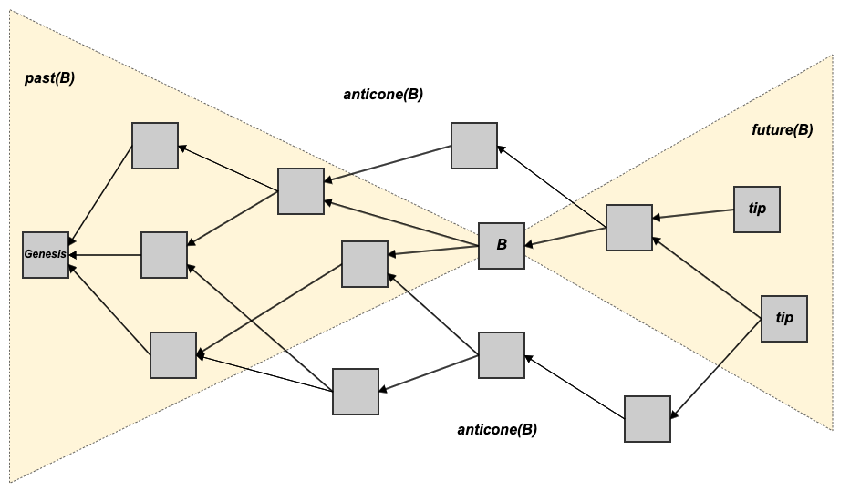
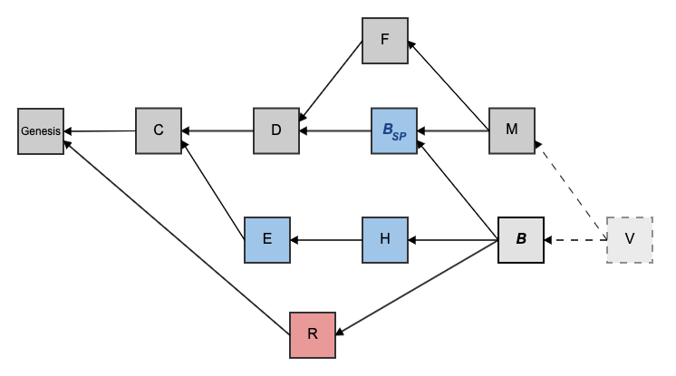

# Anticone

In a [blockDAG](./), the anticone of [block](../blocks/) _B_ is the subset of blocks excluding _B_'s [past](past.md), _B_'s [future](future.md), and _B_ itself.

I.e., it is the set of blocks in the DAG which did not reference _B_ \(directly or indirectly via their ancestors\) and were not referenced by _B_ \(directly or indirectly via _B_’s predecessors\).

## Antichain

A set _A_ ⊆ _G_ is an antichain if ∀_u_, _v_ ∈ _A_ : _u_ \|\| _v_.

In other words, a set of blocks in an antichain if not one of them is [reachable](reachability.md) from any other one of them.

Examples of antichains in the DAG below:

* R, E, C
* R, E, D
* R, H, D
* R, H, B\_SP, F
* R, E, B\_SP, F
* B, M
* B, F

