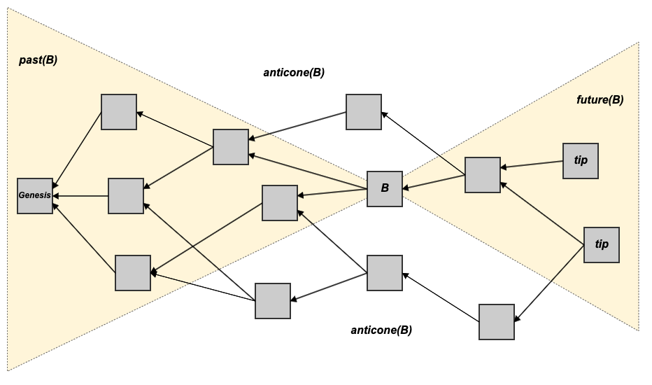

# Tips

In a [blockDAG](./), tips are the set of [blocks](../blocks/) with [in-degree](https://en.wiktionary.org/wiki/indegree) 0 \(usually, the most recent blocks\). In other words, the tips are the set of blocks that do not have any blocks referencing them as [parents](past.md#previous-blocks-parents).

