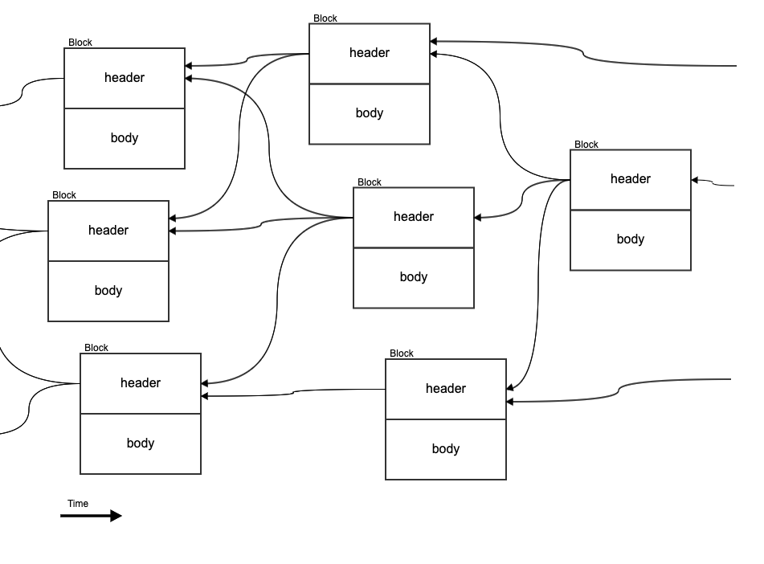

# Blocks

## Overview <a id="General"></a>

A block is a structure that contains transaction data. It consists of:

* a [block header](block-header/)
* a [block body](block-body.md) \(transactions\)

In Kaspa, each block references one or more previous blocks, to form a [DAG](../../glossary.md#dag) of blocks called a [blockDAG](../../glossary.md#blockdag). In Bitcoin, each block references only one previous block to form a blockchain. For an introduction to Bitcoin blocks and the Bitcoin blockchain, see [Mastering Bitcoin Chapter 9](https://github.com/bitcoinbook/bitcoinbook/blob/develop/ch09.asciidoc).



## Contents <a id="Contents"></a>

A block contains the following fields in the following order:

| **Bytes** | **Field** | **Data Type** | **Description** |
| :--- | :--- | :--- | :--- |
| variable | header | Struct: [block header](block-header/) | The block’s block header object. |
| variable | body \(transactions\) | Struct: [block body](block-body.md) | The block’s body \(number and list of transactions, including the [coinbase transaction](../transactions/coinbase-transaction.md).\) |

## Mass <a id="Mass"></a>

A measure used to approximate the storage and computational costs of [transactions](../../glossary.md#transaction) and [blocks](../../glossary.md#block). Greater mass signifies greater byte size and greater computational complexity.

Mass is measured in _grams_:

* 1 byte = 1 gram
* 1 transaction output script = 10 grams
* 1 signature operation = 10,000 grams

#### Block Header Mass

A measure of the mass of a block header, as follows:

```text
Block Header Mass [gram] = 1 * size of block header in bytes
```

#### Block Body Mass

A measure of the mass of a block body, as follows:

```text
Block Body Mass [gram] = 1 * size of the numTxs field in bytes
                       + sum_{1..numTxs}(Transaction Mass)
```

#### Block Mass

A measure of the mass of a block, as follows:

```text
Block Mass [gram] = Block Header Mass
                  + Block Body Mass
```

A block’s mass is limited to 10,000,000 grams.

## Example <a id="Example"></a>

00000010034deee058696ebd49fa5b9d2608f1676759c72cf8463c5d782eaf522cec22000095821365032248be7e1b62d3d8504aa037f6ddb22f6373aca6c742e54f4b000001cf2a8ff4c5feca3c9adce431aaa0bd2cc8527ba9ad9988b327ed02e76400004e2a7018d0cb42ed8c7f1f9630bd7ce30cdecfb503414254b198b8fe763867ef91578cec482a2aebe1ae871d76bf133183cbaef5a121732fffc4365cf8ae9b7ece4cc6742a607d25938cc2a1445c5707065bba6c9ecf34ad3251f650cbf97c1f81338b5e00000000ffff7f1e1fe540c463ebd8330101000000034deee058696ebd49fa5b9d2608f1676759c72cf8463c5d782eaf522cec220000ffffffff00ffffffffffffffff95821365032248be7e1b62d3d8504aa037f6ddb22f6373aca6c742e54f4b0000ffffffff00ffffffffffffffff01cf2a8ff4c5feca3c9adce431aaa0bd2cc8527ba9ad9988b327ed02e7640000ffffffff00ffffffffffffffff0300f2052a010000001976a9141234e3080bbd4135ca3b330fdc42699f2997cdc088ac00f2052a010000001976a9141234e3080bbd4135ca3b330fdc42699f2997cdc088ac00f2052a010000001976a9141234e3080bbd4135ca3b330fdc42699f2997cdc088ac000000000000000001000000000000000000000000000000000000000000000000000000ae812bdaaed78fafecf97d2c72899212d8e56b94287f76de8fed49e53f42b66c2a1976a9141234e3080bbd4135ca3b330fdc42699f2997cdc088ac123ce465187f8ec82f6b61737061642f

### Breakdown <a id="Breakdown"></a>

```text
                                                                 -- header
                                                                 -- ------
00000010                                                         --   version 16
03                                                               --   numPrevBlocks (This block points to three previous blocks)
4deee058696ebd49fa5b9d2608f1676759c72cf8463c5d782eaf522cec220000 --   hashPrevBlocks[0] (Hash of the 1st previous block, this block points to)
95821365032248be7e1b62d3d8504aa037f6ddb22f6373aca6c742e54f4b0000 --   hashPrevBlocks[1] (Hash of the 2nd previous block, this block points to)
01cf2a8ff4c5feca3c9adce431aaa0bd2cc8527ba9ad9988b327ed02e7640000 --   hashPrevBlocks[2] (Hash of the 3rd previous block, this block points to)
4e2a7018d0cb42ed8c7f1f9630bd7ce30cdecfb503414254b198b8fe763867ef --   hashMerkleRoot
91578cec482a2aebe1ae871d76bf133183cbaef5a121732fffc4365cf8ae9b7e --   acceptedIdMerkleRoot
ce4cc6742a607d25938cc2a1445c5707065bba6c9ecf34ad3251f650cbf97c1f --   utxoCommitment
81338b5e00000000                                                 --   time
ffff7f1e                                                         --   bits
1fe540c463ebd833                                                 --   nonce
                                                                 -- body
                                                                 -- ----
01                                                               --   numTxs (This block has 1 txn - the coinbase transaction)
                                                                 --   txs[1] (coinbase tx)
                                                                 --   -----------
01000000                                                         --   version 1
03                                                               --   numTxIns (this transaction has 3 inputs)
                                                                 --   txIns[0]
                                                                 --   --------
4deee058696ebd49fa5b9d2608f1676759c72cf8463c5d782eaf522cec220000 --     prevTxId
ffffffff                                                         --     prevTxIndex
00                                                               --     scriptSigLen
ffffffffffffffff                                                 --     sequence
                                                                 --   txIns[1]
                                                                 --   --------
95821365032248be7e1b62d3d8504aa037f6ddb22f6373aca6c742e54f4b0000 --     prevTxId
ffffffff                                                         --     prevTxIndex
00                                                               --     scriptSigLen
ffffffffffffffff                                                 --     sequence
                                                                 --   txIns[2]
                                                                 --   --------
01cf2a8ff4c5feca3c9adce431aaa0bd2cc8527ba9ad9988b327ed02e7640000 --     prevTxId
ffffffff                                                         --     prevTxIndex
00                                                               --     scriptSigLen
ffffffffffffffff                                                 --     sequence
03                                                               --   numTxOuts (this transaction has 3 outputs)
                                                                 --   txOuts[0]
                                                                 --   ---------
00f2052a01000000                                                 --     value
19                                                               --     scriptPubKeyLen
                                                                 --     scriptPubKey
                                                                 --     ------------
76                                                               --       opDup
a9                                                               --       opHash160
                                                                 --       opData_20
                                                                 --       ---------
14                                                               --         code
1234e3080bbd4135ca3b330fdc42699f2997cdc0                         --         data[20]
88                                                               --       opEqualverify
ac                                                               --       opChecksig
                                                                 --   txOuts[1]
                                                                 --   ---------
00f2052a01000000                                                 --     value
19                                                               --     scriptPubKeyLen
                                                                 --     scriptPubKey
                                                                 --     ------------
76                                                               --       opDup
a9                                                               --       opHash160
                                                                 --       opData_20
                                                                 --       ---------
14                                                               --         code
1234e3080bbd4135ca3b330fdc42699f2997cdc0                         --         data[20]
88                                                               --       opEqualverify
ac                                                               --       opChecksig
                                                                 --   txOuts[2]
                                                                 --   ---------
00f2052a01000000                                                 --     value
19                                                               --     scriptPubKeyLen
                                                                 --     scriptPubKey
                                                                 --     ------------
76                                                               --       opDup
a9                                                               --       opHash160
                                                                 --       opData_20
                                                                 --       ---------
14                                                               --         code
1234e3080bbd4135ca3b330fdc42699f2997cdc0                         --         data[20]
88                                                               --       opEqualverify
ac                                                               --       opChecksig
0000000000000000                                                 --   lockTime
0100000000000000000000000000000000000000                         --   subnetworkID[20]
0000000000000000                                                 --   gas
ae812bdaaed78fafecf97d2c72899212d8e56b94287f76de8fed49e53f42b66c --   payloadHash[32]
2a                                                               --   payloadLength (VARINT)
1976a9141234e3080bbd4135ca3b330fdc42699f2997cdc088ac123ce465187f8ec82f6b61737061642f -- payload[42] (payload is 0x2a = 42 in this case)
```

TODO:

* [ ] Max size of block
* [ ] Illustration of block
* [ ] Links to DAG, BlockDAG, grams.
* [ ] Example

