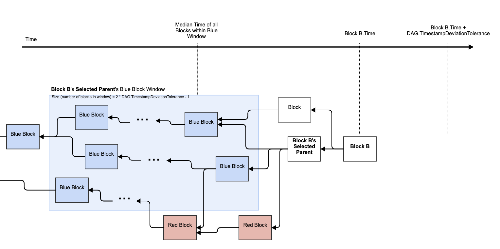
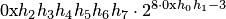

# Block Header

A block header in Kaspa is the first part of a [block](../). It gets repeatedly hashed with a varying nonce until the hash output is below or equal to the target bits in a process called proof of work, and then if the rest of the block is [valid](../block-validation.md), it can be added to the blockDAG.

## Version

The block version is the same as Bitcoin’s block version at the time of forking the btcd code.

The version will be reverted to 1 when the network is launched.


In Bitcoin, block version is used to [signal preparedness to soft-forks](https://github.com/bitcoin/bips/blob/master/bip-0009.mediawiki), and as of now, the same logic is implemented in Kaspa’s code.


## Previous Blocks


In Bitcoin, each block references one previous block, and the blocks form a blockchain.

In Kaspa, each block references one or more previous blocks, and the blocks form a blockDAG.


Each block references the tips of the blockDAG, known to the miner at the time of creating the block, as its previous blocks \(parent blocks\). Referencing previous blocks is done by hashing their headers with SHA256\(SHA256\(header\)\) and storing them in lexicographical order in the array hashPrevBlocks. The block body \(the number of transactions and the transactions themselves\) does not affect the hash.

A block can reference 1-255 previous blocks.


## Hash Merkle Root

The hash merkle root is the [merkle root](merkle-trees.md#Merkle-Root) derived from all transactions within the [block body](../block-body.md).

It is a short commitment to the transactions contents within the block body, and a way to verify a transaction’s inclusion in the block with a short proof.


This is similar to the merkle root in Bitcoin.


## Accepted ID Merkle Root

The accepted ID merkle root is the [merkle root](merkle-trees.md#Merkle-Root) derived from all [transactions accepted by the block](../../consensus/accepted-transactions.md).

It is a short commitment to the transactions that the block accepts.


This is a new field in Kaspa, that is not present in Bitcoin.

In Kaspa, the PHANTOM consensus protocol orders transactions from blocks in the blockDAG created in parallel, and dictates a chain within the blockDAG called the selected parent chain. Blocks in the selected parent chain accept transactions from blocks in their past.

From the perspective of PHANTOM, not all blocks are in the selected parent chain; however, from the perspective of the miner of each new block, its newly created block is extending the selected parent chain. This is why each block specifies a commitment to the transactions which it accepts in the accepted ID merkle Root field in the block header.


## UTXO Commitment

The UTXO commitment is a [hash](../../serialized-data-formats/hash.md) of the [ECMH](https://cseweb.ucsd.edu/~mihir/papers/inc1.pdf) of the [UTXO](../../txo/utxo.md) up to and including the block.

```text
UTXO Commitment = SHA256(
                         SHA256(
                                ECMH(
                                       UTXO(Block + Past)
                                )
                         )
                  )
```

[ECMH](https://cseweb.ucsd.edu/~mihir/papers/inc1.pdf), a special case of incremental hashing, acts as an accumulator for the sum of the entire UTXO, and is represented by 32 bytes. It enables hashes of updated messages to be cheaply computed from previous hashes and [diffs](../../txo/utxo-diffs/) without having to start from scratch.

We use BCHD's implementation of ECMH. For a full specification of ECMH see [here](https://github.com/gcash/bchd/pull/156). ECMH implementation can be ported from [here](https://github.com/gcash/bchd/blob/master/bchec/ecmh.go) and relevant tests are [here](https://github.com/gcash/bchd/blob/master/bchec/ecmh_test.go).

## Time

This is the time the block was mined as reported by the miner in Unix epoch time format.


Time might not be synchronized between different miners, and thus block timestamps cannot be completely relied on. It is possible for example, that a block's timestamp will be earlier than that of one of its parent blocks.


Based on the [SMA Algorithm Developer Spec](../difficulty/sma-algorithm-developer-spec.md), a block’s time is valid from the perspective of a validating node, if its reported time is:

* no more than TimestampDeviationTolerance seconds into the future \(future threshold\)
* not before the [median time](../../../glossary.md#median-time) of the block’s [selected parent block](../../../glossary.md#selected-parent-of-a-block)’s [blue block window](../../../glossary.md#blue-block-window) of size `2 * DAG.TimestampDeviationTolerance - 1` \(past threshold\)

When receiving a new block, a validating node first validates the PoW. Then if the block’s time is beyond the future threshold, it holds in until the block’s time comes and then it validates it; If the block’s time is before the past threshold, the block is forever rejected.



TODO:

* Get correct past timing
* Insert an illustration

## Target Bits

The target bits are a 4 bytes “compact” format that translate to a an 8 digit hexadecimal number, representing the target threshold for proof of work—that is, the target the block header’s hash must not be greater than in order to be valid.


This is the [same as in Bitcoin](https://bitcoin.org/en/developer-reference#target-nbits).

The target bits are calculated by the miner per block based on the [SMA Algorithm](../difficulty/sma-algorithm.md) by multiplying the average timestamp in a moving average window and multiplying it by an adjustment factor.

For implementation, read the [SMA Algorithm Developer Spec](../difficulty/sma-algorithm-developer-spec.md).

## Nonce

An arbitrary 64-bit number that a miner may change to alter the block header hash between hash attempts, in order to get a valid hash \(once it is lower or equal to the _target bits_ threshold\).


In Bitcoin the nonce was 32-bit.

In Bitcoin the mining difficulty increased and 32-bit did not give enough entropy, so after exhausting all options, miners had to change the coinbase transaction or the block time. \[reference?\]


## Serialized Block Contents

A block header contains the following fields in the following order:  
\(all fields are in little endian unless specified otherwise\)

<table>
  <thead>
    <tr>
      <th style="text-align:left"><b>Bytes</b>
      </th>
      <th style="text-align:left"><b>Field</b>
      </th>
      <th style="text-align:left"><b>Data Type</b>
      </th>
      <th style="text-align:left"><b>Description</b>
      </th>
    </tr>
  </thead>
  <tbody>
    <tr>
      <td style="text-align:left">4</td>
      <td style="text-align:left">version</td>
      <td style="text-align:left">int</td>
      <td style="text-align:left">The block&#x2019;s format version.</td>
    </tr>
    <tr>
      <td style="text-align:left">1</td>
      <td style="text-align:left">numPrevBlocks</td>
      <td style="text-align:left">ubyte (uint8)</td>
      <td style="text-align:left">The number of parents this block has in the blockDAG.</td>
    </tr>
    <tr>
      <td style="text-align:left">32 * numPrevBlocks</td>
      <td style="text-align:left">hashPrevBlocks</td>
      <td style="text-align:left">hash</td>
      <td style="text-align:left">An array of numPrevBlocks hashes of parent block headers (sorted by ascending
        ID?)</td>
    </tr>
    <tr>
      <td style="text-align:left">32</td>
      <td style="text-align:left">hashMerkleRoot</td>
      <td style="text-align:left">hash</td>
      <td style="text-align:left">The root of the merkle tree made of hashes of transaction included in
        this block.</td>
    </tr>
    <tr>
      <td style="text-align:left">32</td>
      <td style="text-align:left">acceptedIdMerkleRoot</td>
      <td style="text-align:left">hash</td>
      <td style="text-align:left">The root of the merkle tree made of IDs of <a href="../../consensus/accepted-transactions.md">transactions accepted by this block</a>.</td>
    </tr>
    <tr>
      <td style="text-align:left">32</td>
      <td style="text-align:left">utxoCommitment</td>
      <td style="text-align:left">hash</td>
      <td style="text-align:left">A hash of the ECMH of the UTXO up and including the block.</td>
    </tr>
    <tr>
      <td style="text-align:left">8</td>
      <td style="text-align:left">time</td>
      <td style="text-align:left">uint64</td>
      <td style="text-align:left">Epoch time of the block creation, as reported by the miner in Unix epoch
        time format.</td>
    </tr>
    <tr>
      <td style="text-align:left">4</td>
      <td style="text-align:left">bits</td>
      <td style="text-align:left">uint32</td>
      <td style="text-align:left">
        <p>Target for proof of work in compact form.</p>
        <p>4 bytes representing an 8 digit hexadecimal number</p>
        <p>
          
        </p>
        <p>which translates to the target value</p>
        <p>
          
        </p>
      </td>
    </tr>
    <tr>
      <td style="text-align:left">8</td>
      <td style="text-align:left">nonce</td>
      <td style="text-align:left">uint64</td>
      <td style="text-align:left">The nonce value which makes the hash of the entire block smaller than
        the target.</td>
    </tr>
  </tbody>
</table>

## Example

00000010034deee058696ebd49fa5b9d2608f1676759c72cf8463c5d782eaf522cec22000095821365032248be7e1b62d3d8504aa037f6ddb22f6373aca6c742e54f4b000001cf2a8ff4c5feca3c9adce431aaa0bd2cc8527ba9ad9988b327ed02e76400004e2a7018d0cb42ed8c7f1f9630bd7ce30cdecfb503414254b198b8fe763867ef91578cec482a2aebe1ae871d76bf133183cbaef5a121732fffc4365cf8ae9b7ece4cc6742a607d25938cc2a1445c5707065bba6c9ecf34ad3251f650cbf97c1f81338b5e00000000ffff7f1e1fe540c463ebd833

### Breakdown

```text
00000010                                                         -- version 2
03                                                               -- numPrevBlocks (This block points to three previous blocks)
4deee058696ebd49fa5b9d2608f1676759c72cf8463c5d782eaf522cec220000 -- hashPrevBlocks[0] (Hash of the 1st previous block, this block points to)
95821365032248be7e1b62d3d8504aa037f6ddb22f6373aca6c742e54f4b0000 -- hashPrevBlocks[1] (Hash of the 2nd previous block, this block points to)
01cf2a8ff4c5feca3c9adce431aaa0bd2cc8527ba9ad9988b327ed02e7640000 -- hashPrevBlocks[2] (Hash of the 3rd previous block, this block points to)
4e2a7018d0cb42ed8c7f1f9630bd7ce30cdecfb503414254b198b8fe763867ef -- hashMerkleRoot
91578cec482a2aebe1ae871d76bf133183cbaef5a121732fffc4365cf8ae9b7e -- acceptedIdMerkleRoot
ce4cc6742a607d25938cc2a1445c5707065bba6c9ecf34ad3251f650cbf97c1f -- utxoCommitment
81338b5e00000000                                                 -- time
ffff7f1e                                                         -- bits
1fe540c463ebd833                                                 -- nonce
```

* Inconsistency in byte order in version. It is specified in big endian here.

## Mass

Unlike in Bitcoin, where a block header references one previous block, in Kaspa, a block header may reference up to 255 previous blocks, and therefore the block Header in Kaspa is not of constant size, but depends on the number of previous blocks referenced.

The block header [mass](../#Mass) is therefore 121 + 32 \* numPrevBlocks.

Minimum block header mass = 153 \(corresponding to one previous block hash\)

Maximum block header mass = 8,281 \(corresponding to the max 255 previous block hashes\)

### Block Size Examples

* If a block references one previous block, its size will be 153 bytes.
* If a block references two previous block, its size will be 185 bytes.
* If a block references 7 previous blocks, it’s size will be 345 bytes.

TODO:

* illustration of a few blocks, what gets hashed → arrows to next block hashPrevBlocks.
* plagiarize from the [old spec](https://github.com/daglabs/spec/blob/master/dagcoin.pdf)
* Topic on Hash
* Topic on ECMH
* Topic on Block timestamp

