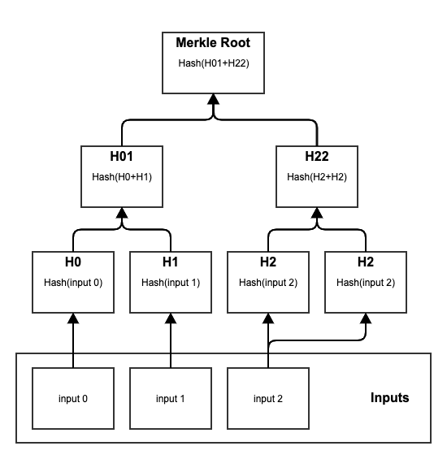

# Merkle Trees

A [merkle tree](https://en.wikipedia.org/wiki/Merkle_tree) is a binary tree of hashes. It is a common cryptographic construct used in blockchains.

It provides two things:

* A succinct cryptographic commitment to the inputs or the tree, whether they are [transactions](../../transactions/) in a [block](../), or anything else.
* A way to verify the existence of a single input of the tree with a small proof, rather than with the whole tree.

## Construction 

Merkle trees are constructed from the leaves to the root, as follows:

1. The input data is hashed.
   1. If there is only one input, its hash is the merkle root.
   2. If there is an odd, larger-than-one number of hashes, the last hash is duplicated.
2. The hashes are grouped into pairs, in the order they appear; concatenated; and hashed again, to derive the next level of the tree; and so on, until a single hash is derived, which is the [merkle root](merkle-trees.md#Merkle-Root).

Since the hashes in each level of the tree rely on the hashes of the previous level, changing any of the inputs of the merkle tree will alter the merkle root.

In order to verify the existence of a single input of the tree, only the path in the tree from that input to the merkle root needs to be provided, rather than the whole tree, reducing the proof length to O\(log\(n\)\).

## Merkle Root 

The merkle root is a single hash derived from all the inputs of the merkle tree.

It provides a succinct cryptographic commitment to the inputs or the tree.

## Usage 

Kaspa uses merkle trees in the following places:

* [Hash Merkle Root](./#hash-merkle-root): a commitment in a block header to the transactions included in that block’s body.
* [Accepted ID Merkle Root](./#accepted-id-merkle-root): a commitment in a block header to the transactions accepted by that block.

