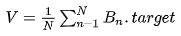

# Simple Moving Average \(SMA\) Algorithm

The [difficulty adjustment](./#difficulty-adjustment) approach Kaspa uses is a form of a moving window average. In this approach each [block](../) determines its expected [difficulty](./) on the spot based on data in the blocks it is connected to. This is in contrast to Bitcoin's fixed window approach which determines that the global difficulty will be adjusted every epoch. The main reason for this is that in a DAG constellation it is hard to even define what an epoch is, as different nodes can get the same DAG in a different order. Nonetheless, there are several reasons to prefer this approach in the chain model as well, especially for small coins whose network can be overwhelmed by a feasibly powerful attacker.

Most of the discussion is based on the ideas implemented by Zawy12, which are [hence documented](https://github.com/zawy12/difficulty-algorithms/issues).

The following assumes that there is some universal "correct" time, and that all nodes have access to a time oracle with some error, and an ability to recognize that their clock is out of sync and readjust it. This model essentially delegates timekeeping responsibilities to the nodes themselves under some assumptions of their ability to do so.

The importance of a time oracle is that local times are the only measure of how long it took to place a block, which is crucial for appropriate retargeting \(difficulty adjustment\). We need our averaging method to take enough blocks into account to smooth out such errors, without making it non-responsive.

Worse yet, malicious miners may use the timestamp leeway to manipulate the difficulty, while being too strict will cause splits.

## Suggested Algorithm in a Naive World 

The expected difficulty of a proposed block _B_ is calculated as follows:

Let _B_\__n_ be the _nth_ _from last_ [blue block](../../consensus/blue-set/#blue-block) in _B.past_ \(so that _B_\_0 = _B_ and _B\_B._[_blueScore_](../../consensus/blue-score.md) = [_Genesis_](../genesis-block.md)\).

Let _R_ = max{_B\_i.timeStamp - B\_j.timeStamp_ \| 1 ≤ _i_, _j_ ≤ _N_ + 1}, in a perfect world \(where all clocks are synchronized and nobody lies about timestamps\) _R_ should tell us how long it took to create _N_ blocks, and we desire _R_/_N_ = _λ_. We hence define the _adjustment factor_ _α_ = _R_/\(_Nλ_\).

Lastly we take the average target

and calculate _B.target_ = _V_ ⋅ _α_.

## Handling Bad Timestamps 

One main problem with the above algorithm is that timestamps are not accurate, due to propagation, clock drifting, and malfeasance.

In order to overcome this, it is required to have rules for rejecting blocks based on the offset of the timestamps.

Handling timestamps which are too far into the past can be handled by comparing the timestamp to those of the previous blocks. Handling timestamps far into the future is much more problematic as it requires use of a clock.

We hence make two physical assumptions:

* There is some universal time which is "correct".
* The nodes have access to a time oracle whose error is given by the random variable _ε._
* Nodes are able to detect when their clock is out of sync.

These assumptions are an idealized model of the fact that there are a lot of timekeeping entities which can easily verify each other \(if Microsoft decide to make their NTP 1% slower, someone with a cesium clock will recognize the error\), and most of them are freely accessible. Given a common reference time the problem of synchronization reduces to the problem of timekeeping \(we no longer need a wall clock, just a stopwatch\). The error accounts for accumulated errors across timekeeping entities, propagation delays, etc.

Under these considerations, we need to choose a parameter _F_ which regulates the allowed error by stating that _B_ is rejected unless:

* _B.timeStamp_ ≥ _median_{_B\_\_1, ..., \_B_\_{2_F_-1}} \(block not too much into the past\)
* _B.timeStamp_ ≤ _T_ + _λF_ \(block not too much into the future\)

Thus, for example, if a node recognizes that its time is not within these criteria \(i.e. that it can not place a block without lying about the time\) it may deduce that its clock is out of sync.

## Effects of _F_ on difficulty 

As stated, giving more leeway allows for more adversarial manipulation.

If I am an attacker wishing to decrease difficulty, I need to use modified timestamps to make _α_ appear as large as possible.

Assuming that in days of peace _R_ ≈ _Nλ_, the worst an attacker can do is to push the least timestamp about _λF_ into the past, and the latest timestamp exactly _λF_ into the future, getting at _R_ ≈ _Nλ_ + 2_λF_ = _λ_\(_N_ + 2_F_\).

In this case we get that _α_ ≈ _N_/\(_N_ + 2_F_\) or 1/_α_ ≈ 1 + 2_F_/_N_.

This means we can't make _F_ irresponsibly large. E.g. if _F_ = _N_/2 then an attacker can potentially make the difficulty half as easier than necessary by placing just two blocks. \(Of course, this attack will only be as effective for a single block, and will have a declining effect for the next _F_ blocks.\)

If we want to limit timestamp attacks to a create a multiplicative error of at most \(1 + _δ_\) we need to have 2_F_/_N_ ≤ _δ_ or 2_F_/_δ_ ≤ _N_.

In can be crudely stated that large _F_ protects us from synchronization problems at the expense of allowing some difficulty manipulation, while choosing large _N_ protects us from such manipulations while making the algorithm less responsive. It is possible to ameliorate this lack of responsiveness by means other than decreasing _N_, such as choosing different averaging mechanisms. This is essentially what Zawy12 works on.

## Choosing _F_ 

Given a fixed _λ_ the choice of _F_ relies on _ε_.

The simplest assumption one can make is that \|_ε_\| is bound by a constant _e_/2, which amounts to saying that the clock discrepancy between two nodes is at most _ε_.

In this case, choosing _F_ such that _λF_ ≥ _e_ suffices to ensure that no node will reject a block emitted by an honest node.

In the real world, the block delay will not be exactly _λ_, and it can in fact be as low as _λ_/\(1 + _δ_\), so we want to make sure that _F_ ≥ \(1 + _δ_\)_e_/_λ_.

\(We can make a bit more realistic assumption that [_ε_ ~ _N_\(0, _σ_^2\)](https://en.wikipedia.org/wiki/Normal_distribution#Notation) for some unknown _σ_, in this case _ε_ is not bounded, but arguments can be made if we allow some constant fraction of the network to be out of sync.\)

## What about _D_\_max? 

It seems that propagation delay are not much of a concern when all nodes are honest. The only comparison between a block timestamp and the system clock is made when trying to approximate if the block is in the future. Propagation delay can only reduce the difference, so it does not increase the risk of dropping a legitimate block.

## Choosing the Parameters 

The proposed difficulty adjustment method relies on the following parameters:

* _N_  - The window size
* _λ_ - The target block delay
* _δ_ - The permitted difficulty deviation
* _F_ - Timestamp deviation tolerance, in block delays
* _e_ - Maximal synchronization discrepancy between two nodes

The relations above tell us how to set _N_ and _F_ given the rest of the parameters.

Assuming _λ_ = 1 and _e_ = 120 \(in units of seconds\) and assuming we allow _δ_ = 10% we need _F_ ≥ \(1 + _δ_\)_e_/_λ_ = 132.

Choosing _F_ = 132 we need _N_ ≥ 2_F_/_δ_ = 2640.

## Decreasing _N_ Further 

Assuming an attacker has a fraction of _p_ of the hash rate, and assuming constant hash rate during the attack, we get on average that _α_ = \(1 - _p_\) + _p_\(1 + _δ_\) = 1 + _δp_.

Assuming that _p_ &lt; 1/2 we get that on average _α_ &lt; 1 + _δ_/2. Further analysis is required, but it seams reasonable that _α_ &gt; 1 + 3_δ_/4 is a rare occurrence even during an attack.

This hints that taking _N_ ≥ 2_F_/\(4_δ_/3\) suffices to ensure that _α_ &lt; 1 + _δ_ most of the time.

## Further Questions 

Is there an approximation for _e_?

Does decreasing _N_ allows for some cascading difficulty decrease attack?

What probabilistic model is suitable to analyze the distribution of _α_?

What about a combination of a hash rate attack and a difficulty decrease attack?

How is all of the above affected assuming exponential hashrate growth?

