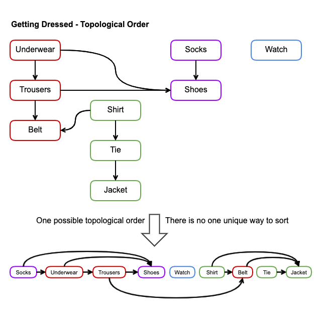
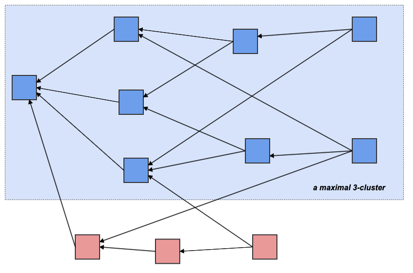
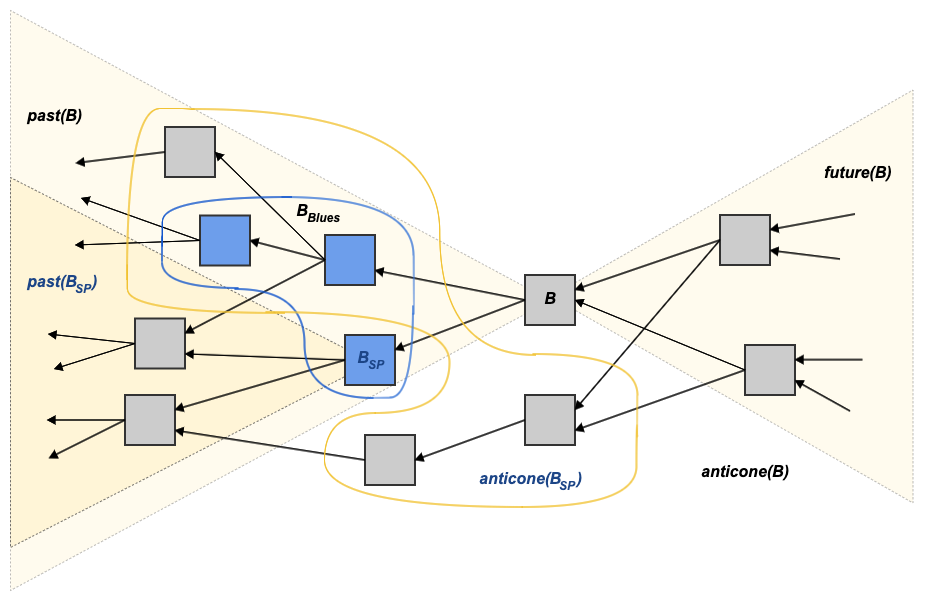
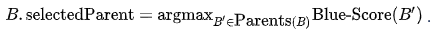
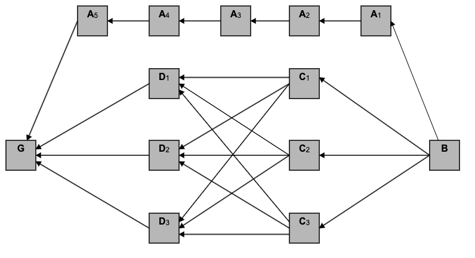

# PHANTOM Consensus


TL;DR: PHANTOM is a blockDAG consensus protocol that returns an ordered list of blocks and a set of "well-connected" blocks to be inherited by the future blockDAG.


The [consensus engine](https://www.investopedia.com/terms/c/consensus-mechanism-cryptocurrency.asp) of Kaspa is the PHANTOM protocol. PHANTOM, as presented in [the original paper](https://eprint.iacr.org/2018/104.pdf), is a generalization of Nakamoto's blockchain, used in Bitcoin, to the setting of a [blockDAG](../blockdag/) \(directed acyclic graph of blocks\).

The very rough idea is that rather than discarding "[stale](https://en.bitcoin.it/wiki/Vocabulary#Stale_Block)" blocks as Bitcoin does, which is wasteful for throughput, security, and computation, one can retain them all, but give higher precedence to blocks and transactions which appear "more trustworthy".

The consensus to reach is, then, not about which blocks should be added to the blockchain and which should be discarded, but about how the blocks in the blockDAG should be ordered.

PHANTOM presents a way to achieve consensus such that the probability that two transactions switch precedence decays exponentially with time.

Furthermore, PHANTOM achieves this goal under a high block creation rate that is non-negligible relative to the network propagation delay \(assuming &gt;50% of computation power is held by honest parties\).

## Background <a id="Background"></a>

### DAGs and Topological Order <a id="DAGs-and-Topological-Order"></a>

"DAG" stands for "directed acyclic graph". As the name suggests, it is simply a [directed graph](https://en.wikipedia.org/wiki/Directed_graph) with no [cycles](https://en.wikipedia.org/wiki/Cycle_%28graph_theory%29).

Another way to define a DAG is a directed graph which admits a [topological ordering](https://en.wikipedia.org/wiki/Topological_sorting): a [total order](https://en.wikipedia.org/wiki/Total_order) ≺ on the nodes of the graph such that _u_ ≺ _v_ [if and only if](https://en.wikipedia.org/wiki/If_and_only_if) there is a [path](https://en.wikipedia.org/wiki/Path_%28graph_theory%29) from _u_ to _v_. The [antisymmetric](https://en.wikipedia.org/wiki/Antisymmetric_relation) property of order relations then becomes equivalent to the graph being acyclic.

Two excellent analogies to this notion are the order in which one takes courses in college, or gets dressed in the morning.



Simple, efficient algorithms for [topologically sorting](https://en.wikipedia.org/wiki/Topological_sorting) a DAG are common knowledge.

### From Blockchain to BlockDAG <a id="From-BlockChain-To-BlockDAG"></a>

The basic idea of going from a chain to a DAG is simple: new blocks can point to not just one [previous block](../blockdag/past.md#previous-blocks-parents), but to several of them. Since blocks can only point to blocks which existed before them, circular paths are impossible, and a DAG structure is attained.

There are several problems with this approach:

* How do we ensure that a DAG structure is maintained?
* Do we have any control of combinatoric features of the resulting graph?
* And most importantly, if there is no unique ordering of the blocks, how can [double spending](../transactions/double-spending.md) be prevented?

The most naive approach is to order the DAG in any topological ordering, and then iterate over the blocks in order, adding to the ledger all transactions in each block which do not contradict any transaction which appears in preceding blocks according to the chosen order.

The challenge then shifts to finding a way to achieve consensus on the ordering, in a way which is resistant to attacks as long as honest players control more than half of the hash power.

### Red vs. Blue <a id="Red-vs.-Blue"></a>

The PHANTOM approach to solving this problem is to choose a "well-connected" \(in a sense to be defined shortly\) subset of the blocks and give them priority. These chosen blocks are then colored “blue” while the others are colored “red”.

[Blue blocks](blue-set/#blue-block) get precedence over [red blocks](red-set.md#red-block) \(in some variants, the red blocks are ignored entirely\), which acts as an incentive for miners to be "well-connected".

This means that a miner wants to connect his new block such that it is "above" \(in the [future](../blockdag/future.md) of\) as many blocks as possible. Since pointing at two related blocks \(such that one of them is an [ancestor](../blockdag/past.md#ancestors) of the other\) does not increase the number of blocks in one's past—in fact, the current implementation of the protocol prohibits a miner from pointing to two related blocks—it is in a miner's best interest to point at exactly all the blocks in the DAG that have no [descendants](../blockdag/future.md#descendants) yet—i.e., all the [tips](../blockdag/tips.md) of the DAG.

However, since it is possible to check if a new block does not contain any transactions which contradict any previous transactions in its [past](../blockdag/past.md), a miner cannot advocate a double spend. In order to attempt a double spend a miner has to give up some of its block's connectedness. The miner has to place his block in a way that the double spending transactions are [anticoned](../blockdag/anticone.md), i.e., he must purposely not connect his block to any tip leading to the transaction the attacker is trying to double spend. This giving up of connectedness reduces the chance that his block will be accepted, denying the miner of the block reward and wasting his computational resources.

The main challenge now is in choosing the "well-connected" [blue set](blue-set/) wisely.

## PHANTOM In Theory <a id="PHANTOM-In-Theory"></a>

We discuss a version of PHANTOM which is provably secure and simple to understand. Unfortunately, this version of the protocol requires solving an [intractable problem](https://en.wikipedia.org/wiki/Computational_complexity_theory#Intractability). However, an understanding of this version is key to understanding how PHANTOM is implemented in practice.

Note that the rest of this page assumes knowledge of some [set theory symbols](https://www.rapidtables.com/math/symbols/Basic_Math_Symbols.html#lnkset) and [logic symbols](https://www.rapidtables.com/math/symbols/Basic_Math_Symbols.html#logic).

### Preliminary Definitions <a id="Preliminary-Definitions"></a>

We assume the [blockDAG](../blockdag/) _G_ is connected and has a unique vertex, the [genesis block](../blocks/genesis-block.md), which does not point to any other vertex. When regarding _G_ as a set \(e.g. appealing to its elements or subsets\) we always mean the set of vertices.

We use &lt; to denote the graph order, i.e. _u_ &lt; _v_ if and only if there is a directed path from _v_ to _u_ \(or simply _u_ is [reachable](../blockdag/reachability.md) from _v_\). Note that, as the graph is acyclic, this is a [partial order](https://en.wikipedia.org/wiki/Partially_ordered_set).

If neither _u_ &lt; _v_ nor _v_ &lt; _u_ nor _v_ = _u_ we say that they are _incomparable_ \(or simply _in each other's_ [_anticones_](../blockdag/anticone.md)\), denoted _u_ ‖ _v_. A set _A_ ⊆ _G_ is an [_antichain_](../blockdag/anticone.md#antichain) if ∀_u_, _v_ ∈ _A_ : _u_ ‖ _v_.

It follows that if _u_ ≠ _Genesis_ then _Genesis_ &lt; _u_.

We denote by Tips\(_G_\) the set of all vertices to which no other vertex points, i.e. Tips\(_G_\) = {_u_ ∈ _G_ \| ∀_v_ ∈ _G_ : _u_ ≮ _v_}.

Given a vertex _u_ ∈ _G_ we define its [past](../blockdag/past.md), [future](../blockdag/future.md) and [anticone](../blockdag/anticone.md) as:

* Past\(_u_\) = {_v_ ∈ _G_ \| _v_ &lt; _u_}
* Future\(_u_\) = {_v_ ∈ _G_ \| _u_ &lt; _v_}
* Anticone\(_u_\) = {_v_ ∈ _G_ \| _u_ ‖ _v_}


The vertex _u_ ∈ _G_ is a [parent](../blockdag/past.md#previous-blocks-parents) of the vertex _v_ ∈ _G_ if _v_ points to _u_, or a [child](../blockdag/future.md#children) if the converse holds.


This convention is the opposite of the usual terminology in graph theory, where traditionally a vertex points to its children and not the other way around. This is because in our structure traversing along an arrow means going _back_ in time, and it makes sense that children are born _after_ their parents. This might become confusing when consulting the literature, so keep on your toes.


Given _u_ ∈ _G_ we denote by _u.\_Parents the set of all its parents. We use the notation \_u.\_Parents rather than Parents\(\_u_\) to emphasize that this information is [stored locally on the block](../blocks/block-header/), so a block might have a list of parents even if it is not included in the graph.

To test your intuition, convince yourself that:

* Future\(_Genesis_\) = _G_ ∖ {_Genesis_}
* _u_ ≠ _Genesis_ ⇔ _Genesis_ ∈ Past\(_u_\)
* _u_ ∈ Tips\(_G_\) ⇔ Future\(_u_\) = ∅
* Tips\(_G_\) is an antichain
* _G_ is an antichain if and only if _G_ = {_Genesis_}
* The union of the collection {Past\(_t_\) : _t_ ∈ Tips\(_G_\)} = _G_ ∖ Tips\(_G_\)

### Expectations of Honest Nodes <a id="Expectations-of-Honest-Nodes"></a>

Every miner should adhere to all sorts of locally checkable conditions, such as that the block one is trying to mine does not contain any [double spending](../transactions/double-spending.md) transactions.

The implementation details of efficiently verifying these conditions are far from trivial, but from a theoretical point of view they may be assumed, so we brush them under the rug for now.

What concerns us is miner behavior that can effect the structure of the graph \(and hence, the consensus\).

We expect the miners to adhere to the following three rules:

* When suggesting to add a new block _B_ to the graph, it must hold that _B.\_Parents = Tips\(\_G_\).
* Upon completing the [difficulty](../blocks/difficulty/) puzzle validating a block _B_ \(i.e. successfully mining a new block\), the new block must be transmitted _immediately_.
* When hearing of a new valid block, propagate it to peers _immediately_.

Any miner or node which does not adhere to these rules is considered _malicious_.

**Exercise**: convince yourself that if a received block _B_ is such that _B.\_Parents is not an_ [_antichain_](../blockdag/anticone.md#antichain)_, then whoever posted \_B_ is necessarily malicious.

These rules are harder to verify. For example, assume that we get a block which points to vertices not in Tips\(_G_\), how do we know that the miner who created _B_ had malicious intent? It might be the case that _B_ was pointing to the tips at its creation, but by the time knowledge of _B_ reached us we already accepted other blocks, changing our view of the graph from that of _B_ during its creation.

The answer is that we do not. From a given node's point of view, these two cases are indiscernible. The PHANTOM algorithm is designed such that the consensus of the network _as a whole_ disadvantages malicious miners. The intuition is that nodes close to a miner \(in the network topology\) should get said miner's block before getting blocks from further miners, giving it an advantage over blocks from further sources, which balances the disadvantage its blocks has from nodes further from it. Cheating miners further disadvantage themselves from the get go, and so the consensus converges quickly to disfavor them.

### Proof of Work <a id="Proof-Of-Work"></a>

Proof of work in Bitcoin and in PHANTOM serves the same two goals, namely:

1. to counter Sybil attacks on consensus voting rights by introducing processing costs
2. to throttle block throughput

To understand what is implied by throttling throughput, one must understand its purpose. The point of slowing down block creation in Bitcoin is to give a block enough time to propagate through the network to all participants, thus preventing the ratio of colliding blocks. Assuming a block takes an average of 15 seconds to propagate to all miners, and a new block is mined on average once every 10 minutes, there will be on average 2.5% \(15s/10m\) colliding blocks that the the Bitcoin network discards \(orphaned blocks\). As a result, the network is wasting about 2.5% of its work and security. Further decreasing the block rate would reduce this wastage. Bitcoin’s 10 minutes delay between blocks is a trade-off between confirmation times and wasted computation.

While in Bitcoin, the consensus protocol itself limits the throughput, PHANTOM lets only the physical limits of the network nodes and communication infrastructure \(i.e. nodes' capacity and the roundtrip time of the network\) limit the throughput. PHANTOM includes all legal blocks and is limited only by the network infrastructure. Nonetheless, spacing out the block creation to some degree allows PHANTOM to maintain an approximately constant bound on the size of the [anticone](../blockdag/anticone.md), which is crucial to what follows.

Indeed, assume that _D_ is the delay between the two furthest nodes in the network, and that the block _B_ was published \(by an honest miner\) at time _t_.

Then _B_ will be included in the past set of any block created after _t_ + _D_ and in the future set of any block created before _t_ - _D_. It follows that if all of the miners are honest then Anticone\(_B_\) will only contain blocks created in the time interval \[_t_ - _D_, _t_ + _D_\]. When some small portion of the miners are dishonest, this still holds for _most_ blocks in Anticone\(_B_\).

The proof-of-work mechanism guarantees that the number of blocks created in an interval of length 2 ⋅ _D_ is typically below some constant.

### Maximum k-Cluster <a id="Maximum-k-Cluster"></a>

The maximum k-cluster formally captures the notions of a "well-connected" set.

Intuitively, a DAG is well-connected if any vertex is reachable to or from most other vertices in the DAG, i.e., if the anticone of each element is small. This motivates the following definition:

A DAG is called a _k-cluster_ if all _u_ ∈ _G_ satisfy that \|Anticone\(_u_\)\| ≤ _k_.

This leads to the algorithmic problem known as _Maximum k-Cluster SubDAG_ or more briefly, _MCS\_k_:

* **Input**: DAG _G_
* **Output**: A subgraph of _G_ of maximal size which is a _k_-cluster



### The Infeasible PHANTOM Protocol <a id="The-Infeasible-PHANTOM-Protocol"></a>

Given all of the above we have a complete description of a consensus mechanism.

Upon placing a new block \(which locally appears legitimate\), run _MCS\_k_ on the resulting graph, use the output _k_-cluster as a [blue set](blue-set/), and give precedence to the blue blocks over the non-blue \(red\) blocks.

The meaning of "give precedence" is open to interpretation. The original paper suggests to incorporate the transactions in red blocks with low precedence \(ignoring all transactions which conflict higher precedence transactions\), while the implementation approach at the time of writing is to ignore them altogether.

This approach is provably sound: the probability that a blue block will turn red provably declines exponentially fast with respect to how long this block has been blue, even under a high block creation rate that is non-negligible relative to the network's propagation delay \(as long as most of the computational power is held by honest parties\).

Unfortunately, _MCS\_k_ is [NP-complete](https://en.wikipedia.org/wiki/NP-completeness), and is hence unsuitable for an ever-growing DAG. In practice, this is reconciled by a heuristic approach.

## PHANTOM In Practice <a id="PHANTOM-In-Practice"></a>

We discuss in detail the ideas used in our implementation of PHANTOM. This section is meant to accompany the implementation specification.

We first describe a \(slightly modified version of the\) greedy version of PHANTOM described in the original article called GHOSTDAG. This version does not require solving any NP-complete problems, but it is still hard to implement, as it still requires solving a problem whose \(in\)tractability is unclear. To circumvent this issue, we suggest yet another version called HEPSGHOST which is a variant of GHOSTDAG which is easier to implement, and is the current chosen variant to implement.

All algorithms mentioned above boast a greedy approach which can be roughly described in three steps:

1. Isolate a particular chain running from the virtual block to the genesis block.
2. Iterate over blocks in the chain, determining what is the blue set from each block's point of view.
3. Order the blocks such that the blue blocks get precedence.

Once the blocks are ordered, the transactions can be extracted from them in order, where each transaction [contradicting](../transactions/double-spending.md) a transaction which was already extracted is discarded.

### PHANTOM Order <a id="PHANTOM-Order"></a>

The distributed nature of the protocol forces all choices to be well-defined so they can be uniform across the network.

Recall the many ways to topologically order getting dressed described in the beginning of this page. We need a well-defined rule to deterministically order blocks in a way that anyone applying the rule on the same input, will get the same output.

To solve this, we decree that non-comparable blocks are ordered by [hash](../serialized-data-formats/hash.md) \(where the actual value of the block hash is determined in the [block implementation specification](../blocks/)\).

I.e., if ≺ is the topological order then _B_ ≺ _B'_ if and only if

* _B_ ∈ past\(_B'_\), or
* _B_ ‖ _B'_ and _B_.Id &lt; _B'_ \_.\_Id

This defines a unique total order of _G_ which we call the _PHANTOM order._

### Selected Parent <a id="Selected-Parent"></a>

Each block _B_ maintains information sufficient to uniquely isolate a subset of Past\(_B_\) which is a large _k_-cluster. We denote this set Blue-Set\(_B_\). We also denote Blue-Score\(_B_\) = \|Blue-Set\(_B_\)\|. We think of Blue-Set\(_B_\) as the set of blue blocks from _B_'s worldview.

This includes the [virtual block](../blockdag/virtual-block.md), whose corresponding blue set is the blue set of the entire DAG.

We need the amount of data stored in each block to be bound by a constant. To achieve this, we first choose a particular parent of _B_ denoted _B_.selectedParent. We now notice the following two trivial facts:

* Blue-Set\(_B_\) = Blue-Set\(_B_.selectedParent\) ⋃ _B_.Blues, where _B.\_Blues = \(Blue-Set\(\_B_\) ⋂ Anticone\(_B.\_selectedParent\)\) ⋃ \_B_.selectedParent \(see figure\)
* By definition of a _k_-cluster we get that \|_B_.Blues\| ≤ _k_ \(because _B.\_Blues ⊆ Anticone\(\_B_.selectedParent\) ⋃ _B_.selectedParent\)



The blue blocks in _B_'s point of view, which are not already in _B.\_selectedParent \(denoted \_B_\__SP_\)'s point of view, are exactly _B_.Blues = \(Blue-Set\(_B_\) ⋂ Anticone\(_B_.selectedParent\)\) ⋃ _B_.selectedParent.

Hence, by storing _B_.Blues we get exactly what we wanted. The amount of data attached to each block is constant, while it is easy to calculate Blue-Set\(_B_\):

```text
Blue-Set(Block B):
    if B is Genesis:
        return {B}
    return B.Blues union Blue-Set(B.selectedParent)
```

However, such a calculation becomes inefficient as the graph grows and is not needed in practice.

The missing detail is how _B_.[selectedParent](selected-parent.md) is chosen. For various considerations, further discussed in the next section, it was decided that:



### Selected Parent Chain <a id="Selected-Parent-Chain"></a>

The [virtual block](../blockdag/virtual-block.md) also has a selected parent. This defines a chain of selected parents running from the selected parent of the [virtual block](../blockdag/virtual-block.md) to the [genesis block](../blocks/genesis-block.md). We call this [the selected chain of the DAG](selected-parent-chain.md#selected-parent-chain-of-the-blockdag).

More precisely, the selected chain of the DAG is comprised of:

**B₁** = Virtual.selectedParent, **B₂** = B₁.selectedParent, ..., **B\_n** = B\_{n-1}.selectedParent = Genesis

### More on Choosing the Selected Parent <a id="More-On-Choosing-The-Selected-Parent"></a>


This section is not essential, but it is an illuminating discussion. Working through this example is a great sanity check for your understanding of PHANTOM.


In the original GHOSTDAG algorithm, _B_.selectedParent was chosen differently. Namely, rather than choosing the parent with maximal [blue score](blue-score.md), the algorithm chose the parent which would maximize Blue-Score\(_B_\) once the algorithm is complete.

This latter approach has theoretical advantages but its implementation can be painful, so the alternative approach described above was chosen.

We do stress that these approaches are _not_ equivalent.

Consider the following scenario in which _k_ = 2. We want to choose a designated \(selected\) parent for the new block _B_:



Note that for any block _B'_ ≠ _B_ we have that Past\(_B'_\) is itself a 2-cluster, so that Past\(_B'_\) = Blue-Set\(_B'_\).

Hence, the current approach will choose _B_.selectedParent = _A_\_1, and we get that Blue-Set\(_A_\_1\) ⊆ Blue-Set\(_B_\).

However, {_A_\_2, _A_\_3, _A_\_4, _A_\_5} ⊂ Blue-Set\(_A_\_1\) ∩ Anticone\(_C_\_1\) so if _C_\_1 ∈ Blue-Set\(_B_\) it follows that Blue-Set\(_B_\) is not a 2-cluster. Thus, _C_\_1 ∉ Blue-Set\(_B_\) and for identical reason the same holds for _C_\_2, _C_\_3, _D_\_1, _D_\_3.

Hence, it follows that Blue-Set\(_B_\) = {_A_\_1, _A_\_2, _A_\_3, _A_\_4, _A_\_5, _G_} so Blue-Rank\(_B_\) = 6.

However, had we chosen _B_.selectedParent = C\_1 we would have gotten that Blue-Set\(_B_\) = {_C_\_1, _C_\_2, _C_\_3, _D_\_1, _D_\_2, _D_\_3, _G_} and so Blue-Rank\(_B_\) = 7.

### Choosing The Blue Blocks <a id="Choosing-The-Blue-Blocks"></a>

#### GHOSTDAG <a id="GHOSTDAG"></a>

All of the above discussion leads to the following approximate version of PHANTOM known as GHOSTDAG.

Upon receiving a new block _B_:

* Make sure that _B_ does not conflict itself or its past
* Choose _B_.selectedParent
* Let \(_B_\_1, ..., _B_\__N_\) be Anticone\(_B_.selectedParent\) in PHANTOM order
* For _i_ = 1, ..., _N_:
  * If both:
    1. \|Anticone\(_B_\__i_\) ∩ Blue-Set\(_B_\)\| ≤ _k_, and
    2. Adding _B\_i_ to _B_.Blues does not increase the size of the blue anticone of any other blue block to be larger than _k_
  * Then add _B\_i_ to _B_.Blues

**Exercise**: Can you come up with a scenario where condition \(2\) above fails?

The problem with this approach is that there is no obvious efficient way to verify the condition above.

#### HEPSGHOSTDAG <a id="HEPSGHOSTDAG"></a>

Given a block _B_ we define it's _k-grandpa_ to be the selected parent of its selected parent … of its selected parent, _k_ times. More formally, it is the unique element on the selected chain which is reachable from _B_ in _k_ steps. Note that _B_'s 1_-grandpa_ is just _B_.selectedParent.

We have the following easy observations:

* The GHOSTDAG algorithm stated above will halt after _k_ blocks has been added to \_B.\_Blues
* We will not add any block which is not in Future\(_k_-grandpa\(_B_.selectedParent\)\)

The latter is because any block not in Future\(_k_-grandpa\(_B_.selectedParent\)\) has at least _k_ + 1 elements of the selected chains \(which are always blue\) in its anticone. Convincing yourself of the former observation remains an exercise.

This leads to the following algorithm, called HEPSGHOSTDAG.

Upon receiving a new block _B_:

* Make sure that _B_ does not conflict itself or its past
* Choose _B_.selectedParent
* Let \(_B_\_1, ..., _B\_N_\) be Anticone\(_B_.selectedParent\) ∩ Future\(_k_-grandpa\(_B_.selectedParent\)\) in PHANTOM order
* Let _B_.Blues = {_B_\_1, ..., _B\_k_}

Which is much easier to implement.

HEPSGHOSTDAG currently does not have a proof.

### Ordering the Blocks <a id="Ordering-The-Blocks"></a>

The [blue set](blue-set/) of a block is recursively defined as follows:

```text
Blue-Set(B) = {
    Blue-Set(B.selectedParent),
    B.selectedParent,
    B.blues ordered by blueScore asc, hash asc.
}
```

In other words:

1. First, the ordering is inherited from B’s selected parent. The blue set of Genesis is an empty group.
2. Then, B’s selected parent.
3. Then, the rest of the blocks from _**B.blues**_, i.e. blocks from _**B.selectedParent**_’s anticone. They are ordered by ascending [blue score](blue-score.md) \(and by ascending hash as a blue score tie-breaker\).

