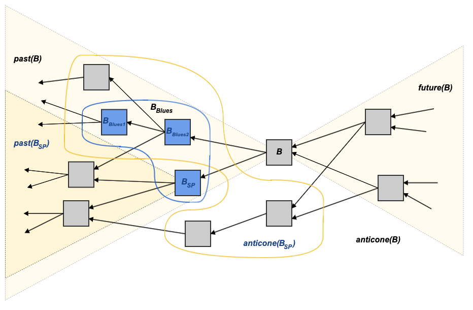

# Accepted Transactions

When a [chain block](selected-parent-chain.md#Chain-Blocks) B is added to the [DAG](../blockdag/), [transactions](../transactions/) that are included in [blue blocks](blue-set/#blue-block) that B [merges](merged-blocks.md) and that spend [outputs](../txo/outpoint.md) available in the [UTXO set](../txo/utxo-set/) are accepted, while transactions that do not are rejected.

Each block’s [header](../blocks/block-header/) contains the field [`acceptedIdMerkleRoot`](../blocks/block-header/#accepted-id-merkle-root), which is a commitment to the transactions accepted by this block.

Note: a block B's acceptedIdMerkleRoot may contain transactions whose outputs are not in the [UTXO set](../txo/utxo-set/). This is the case when two transactions are in B's merged blue blocks, and one of them, in a later block, consumes the outputs of the first, in an earlier block.

## Motivation 

In Bitcoin and similar cryptocurrencies, every block header contains a commitment to the block’s transactions in the form of the root of a [merkle tree](../blocks/block-header/merkle-trees.md) containing all the block’s transactions. This way, [SPV](https://en.bitcoinwiki.org/wiki/Simplified_Payment_Verification) nodes can sync only the headers, as well as proofs for transactions that are of interest to them.

This is made possible by the fact that, in Bitcoin, inclusion of a transaction in a block means acceptance of said transaction into the [UTXO Set](../txo/utxo-set/) \(or into the state\).

In Kaspa, the above assertion is incorrect, as parallel blocks, unaware of each other’s existence, may include [double spending](https://daglabs.atlassian.net/wiki/spaces/SPEC/pages/614432951/Double+Spending) transactions. [Acceptance](https://daglabs.atlassian.net/wiki/spaces/SPEC/pages/584483099/Accepted+Transactions) of one transaction over another conflicting transaction depends on the total ordering of the blocks as decided by the [PHANTOM](https://daglabs.atlassian.net/wiki/spaces/SPEC/pages/594870306/Copy+of+The+PHANTOM+algorithm) consensus algorithm.


Parallel blocks might contain contradicting transactions, that double spend the same UTXO. The [PHANTOM consensus algorithm](./) ultimately decides on an ordering of the blocks, from which a consistent order of transactions and a consistent state of the UTXO is extracted. Only the first \(according to PHANTOM order\) transaction that spends a UTXO is acceptable, while later transactions that try to spend an already [spent TXO](../txo/stxo.md) cannot be and are not accepted.


## Solution 

The solution is to add another commitment to every block header, called `acceptedIDMerkleRoot`, that contains the [root of the merkle tree](../blocks/block-header/merkle-trees.md#Merkle-Root) made of the IDs of all the transactions from the block’s blue merged blocks.

Note that it does not contain the following:

* transaction from [red blocks](red-set.md#red-block)
* transaction from [merged blocks](merged-blocks.md) that try to spend an output that was not part of the [UTXO set](../txo/utxo-set/) of the [merging block](merged-blocks.md#a-blocks-merging-chain-block).
* transactions included in the block itself; those transactions may be accepted by one of this block’s [descendants](../blockdag/future.md#descendants) - more precisely, by the first descendant block in this block’s [future](../blockdag/future.md) that becomes part of the [selected parent chain](selected-parent-chain.md). This process happens in a matter of seconds.

This way, Kaspa achieves a similar result to Bitcoin - any transaction included in a [chain block](selected-parent-chain.md#Chain-Blocks)’s `acceptedIDMerkleRoot` can be considered [confirmed](confirmations/) as long as there was no [reorg](reorganization-of-the-blockdag-reorg.md).

## Calculating the Accepted Transactions of a Block 

In order for a block B to point out which transactions it accepts, it starts off with the [UTXO set](../txo/utxo-set/) of its [selected parent](selected-parent.md) UTXO-Set\([Past](../blockdag/past.md)\(B.selected\_parent\)\), i.e. the UTXO set as it was known to its selected parent block \(B.selected\_parent\) just before its selected parent was created. In the diagram below, this is the UTXO set of blocks in the cone marked Past\(B\_SP\), and it does not include B\_SP itself.

Kaspa nodes maintain \(among other things\) a current state of the UTXO set, and \(if the node was run with the [acceptanceIndex](../../components/kaspad-full-node/usage/cli.md#Database) flag\) the accepted transactions of each block.

Furthermore, the UTXO set of any given block can be “restored” using [UTXO diffs](../txo/utxo-diffs/).

The UTXO should then be updated with transactions according to [PHANTOM](./) order. This means that first the B.selected\_parent is added, and then the rest of the B's merged blocks are added according to topology, [blue score](blue-score.md), and hash.

### Adding Transactions from the Selected Parent 

Transactions from B.selected\_parent come first according to PHANTOM. Each transaction’s [inputs](../transactions/#Transaction-Inputs-1) are removed from the UTXO set, and its [outputs](../transactions/#Transaction-Outputs) are added to the UTXO set. The transactions are also added to the list of transactions accepted by B.

### Adding the Transactions from Merged Blocks 

The rest of the blocks in B's merged blocks are processed in PHANTOM order, and for each transaction in them, given that their inputs are available in the UTXO set, the UTXO set is updated and the transaction is added to the list of transactions accepted by B.

At the end of this process, block B has a consistent state of the UTXO set that includes its past in PHANTOM order, but excludes transactions from B itself; and a list of transactions that it accepts. Those transactions are then added to a [merkle tree](../blocks/block-header/merkle-trees.md) and its root is used as the commitment to all the accepted transactions and placed in the block’s [header](../blocks/block-header/).

### Updating Upon New Blocks 

While attempting to mine the next block, as a miner becomes aware of new blocks and validates them, transactions from them are added to the list of transactions accepted by the block attempted to be mined.

### Updating Upon Changes to the Selected Parent Chain 

While attempting to mine the next block, as a node observes [reorgs](reorganization-of-the-blockdag-reorg.md) to its selected parent chain, transactions that were accepted up until the reorg may now be no longer accepted. The node reverts accepted transactions from the blocks reorged out of the selected parent chain and their UTXOs. If the node was run with the acceptanceIndex flag, a list of the accepted transactions by each block is present to assist in this process. This brings the UTXO set back to the state it was before the blocks reorged out were added. Then, transactions from the blocks reorged into the selected parent chain are accepted and the UTXO set updated according to them.

