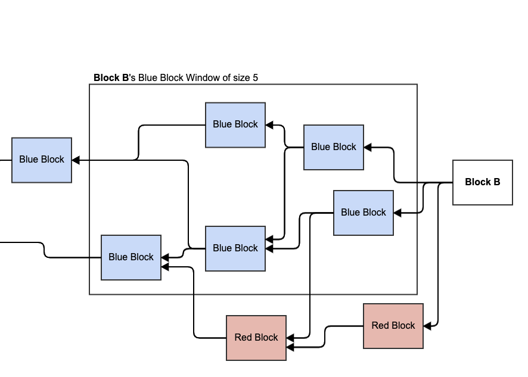

# Block Blue Window

The block blue window is a function that accepts a [block](../../blocks/) B and a window size N and returns a group of N [blue blocks](./#blue-block) in the [past](../../blockdag/past.md) of B in [PHANTOM](../) order.

## Input

* A block
* A blue window size

## Output

* An array the size of the input blue window size, consisting of blue blocks from the input block’s past, in descending PHANTOM order.

If there are more blue blocks in the input block’s size to return, the latest ones according to PHANTOM order are returned.

If there are not enough blue blocks, the remaining space in the window is repeatedly filled with the [genesis block](../../blocks/genesis-block.md).

