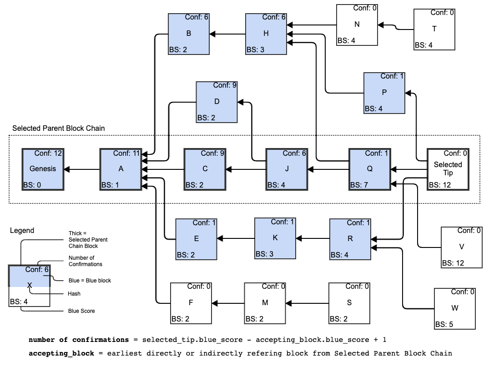

# Confirmations

Confirmations allow users to evaluate the level of [finality](../finality-1/) of a transaction they received.

As a rule of thumb, the more blocks a [block](../../blocks/) or a [transaction](../../transactions/) are “buried under”, the more confirmations it will have.


A high number of confirmations is not the sole indicator of the finality of a transaction. If the transaction has confirmations, but also has a [double spending](../../transactions/double-spending.md) transaction in its [anticone](../../blockdag/anticone.md), as long as the finality window has not passed, there is still an exponentially diminishing but existing chance that the transaction with confirmations will get unaccepted due to [reorgs](../reorganization-of-the-blockdag-reorg.md), and the double spending transaction will take precedence over it.


## Block Confirmations <a id="Block-Confirmations"></a>

The number of confirmations of a block B is the difference in [blue score](../blue-score.md) between the blockDAG’s [selected tip](../selected-parent.md#selected-tip-of-the-blockdag) and block B’s [merging chain block](../merged-blocks.md#a-blocks-merging-chain-block) + 1.

```text
Block.confirmations =
    DAG.selected_tip.blue_score - Block.merging_chain_block.blue_score + 1
```


In Bitcoin, the number of confirmations of a block is the difference between the [height of the block](../../blockdag/block-height.md) and the height of the longest blockchain.

In Kaspa, a block’s [blue score](../blue-score.md) is the [blockDAG](../../blockdag/) generalization of blockchains' block height.


If the block has no [merging chain block](../merged-blocks.md#a-blocks-merging-chain-block), it has no confirmations; unless it is the [selected tip](../selected-parent.md#selected-tip-of-the-blockdag), and then it has 1 confirmation by definition.

If the block is [red](../red-set.md#red-block), it has no confirmations.



## Transaction Confirmations <a id="Transaction-Confirmations"></a>

The number of confirmations of a transaction T is the difference in [blue score](../blue-score.md) between the blockDAG’s [selected tip](../selected-parent.md#selected-tip-of-the-blockdag) and the [merging chain block](../merged-blocks.md#a-blocks-merging-chain-block) of transaction T’s containing block + 1.

```text
Txn.confirmations =
    DAG.selected_tip.blue_score - Txn.merging_chain_block.blue_score + 1
```

If the transaction was not yet accepted \(it is in the [mempool](../../../glossary.md#mempool)/it is in a [red block](../red-set.md#red-block)/it double spends an [output](../../txo/)\) then it has 0 confirmations.

If the transaction is in the [selected tip](../selected-parent.md#selected-tip-of-the-blockdag), it has 1 confirmation by definition.

If the transaction is in any [tip ](../../blockdag/tips.md)of the [blockDAG ](../../blockdag/)that is not the [selected tip](../selected-parent.md#selected-tip-of-the-blockdag), it has 0 confirmations.

