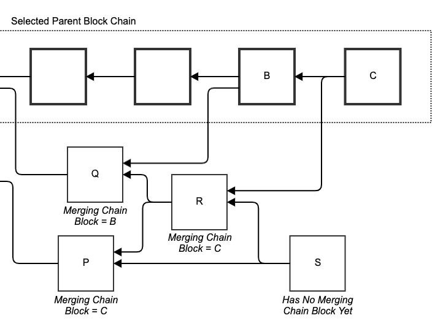

# Merged Blocks

Every newly mined [block](../blocks/) considers itself as the next [chain block](selected-parent-chain.md#Chain-Blocks), i.e. the next block on the [selected parent chain](selected-parent-chain.md). As such, it merges \("adds'' to the [blockDAG](../blockdag/)\) new blocks: its [selected parent](selected-parent.md) and the blocks in its selected parent's [anticone](../blockdag/anticone.md). In doing so, it adds up to [k](parameters.md#k) [blue blocks](blue-set/#blue-block), referred to as the block's merged blue blocks.

## A Block's Merging Chain Block

Several blocks may claim to [merge](merged-blocks.md) a block B. They are all referred to as B’s merging blocks. Ultimately only one of them will be settled by the [PHANTOM consensus algorithm](./) as a [chain block](selected-parent-chain.md#Chain-Blocks). The [chain block](selected-parent-chain.md#Chain-Blocks) that [merges](merged-blocks.md) block B is referred to as B's merging chain block. In other words, a block B's merging chain block is the earliest [chain block](selected-parent-chain.md#Chain-Blocks) \(the block with the lowest [blue score](blue-score.md) on the [selected parent chain](selected-parent-chain.md)\) that references B [directly](../blockdag/past.md#previous-blocks-parents) or [indirectly](../blockdag/past.md#ancestors).

* Block B merges block Q.
* Block C merges blocks B, R, and P \(indirectly\).
* Blocks C and S are not merged yet.

