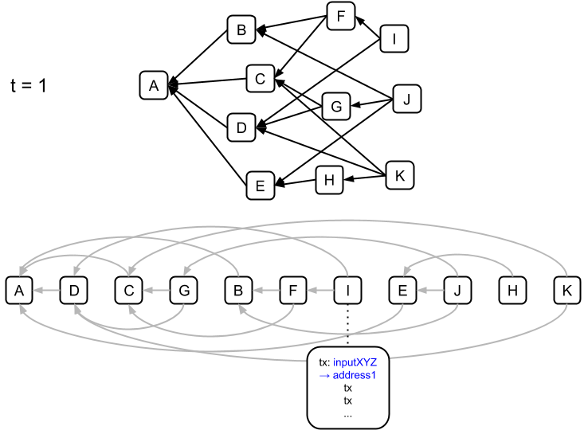
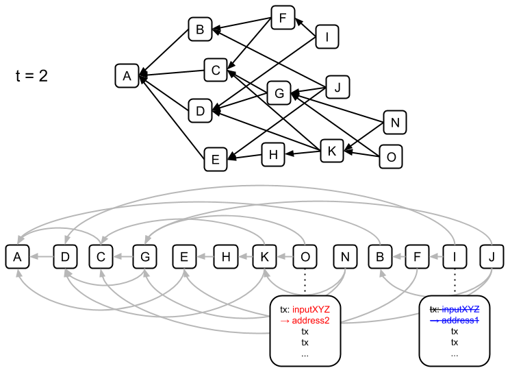

# Reorganization of the BlockDAG \(Reorg\)

In Bitcoin, a node’s observed blockchain will undergo a [reorganization](https://en.bitcoin.it/wiki/Chain_Reorganization) if the node discovers a new chain that excludes some blocks from its current blockchain and is longer than its current chain. The node will switch over to this new chain, and the excluded blocks become [stale blocks](https://en.bitcoin.it/wiki/Vocabulary#Stale_Block). Slight reorganizations of the chain, if they occur, may be caused by network asynchronicity, whereas large reorganizations are likely to be caused by attackers with sufficient mining power to overtake the main chain, or by some catastrophic split in the network.

Since [PHANTOM](./) is also proof-of-work-based, it too is susceptible to reorgs. Each node’s canonical set of [transactions](../transactions/) is derived from the order of [blocks](../blocks/) that the protocol produces: a node locally computes the order of blocks, then chronologically accepts consistent \(non-[double-spending](../transactions/double-spending.md)\) transactions. In a [DAG](../blockdag/) reorg, a successful attacker may change the initially observed order of a node’s local DAG. If transaction _tx_ was previously included in the node’s transaction set, an attacker could create blocks that manipulate the order such that _tx_ is no longer part of this set. This requires publishing a block with a transaction that double spends the [TXO](../txo/) spent in _tx_, and having that block precede the block containing _tx_.

The above figure shows two blockDAGs that a node hypothetically observes at two different times and the DAGs’ corresponding possible orderings, produced via PHANTOM. With the addition of blocks N and O in the second DAG, PHANTOM will produce a different [red set](red-set.md) and [blue set](blue-set/), and thus the ordering is changed drastically. If there are conflicting transactions in, say, blocks I and O, then the previously accepted transaction in block I will no longer be in the node’s transaction set.

As in Bitcoin, slight reorgs are likely spontaneous, whereas deep reorgs may be the effect of an attack on the network.

While the above images show the effect of a reorg in the context of an arbitrary topological ordering of the entire blockDAG \(to illustrate the difference between chain and DAG reorgs\), in practice, we view the effect of a reorg on a node's [selected parent chain](selected-parent-chain.md) produced by the [GHOSTDAG](./#PHANTOM-In-Practice) ordering. If a node's observed selected chain is reorged, then the node must note changes in its [chain blocks](selected-parent-chain.md#Chain-Blocks), [merged blocks](merged-blocks.md), and [accepted transactions](accepted-transactions.md).

