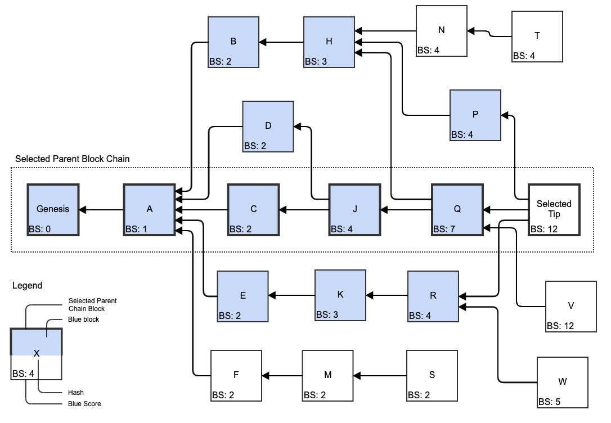

# Selected Parent Block Chain

The selected parent block chain is a chain of [blocks](../blocks/) formed from a block to the [genesis block](../blocks/genesis-block.md) by recursively adding to the chain the [selected parent block](selected-parent.md).


Also abbreviated as "the selected parent chain“ or "the selected chain” or even "the chain".


From each block's perspective, it is part of the selected parent chain, and as such, each block has a selected parent chain going from it back to genesis; however, unless [specifically noted](selected-parent-chain.md#selected-parent-chain-of-a-block), the selected parent chain does not refer to such chains, but rather to the [global chain](selected-parent-chain.md#selected-parent-chain-of-the-blockdag) from the [selected tip of the blockDAG](../../glossary.md#selected-tip-of-the-blockdag) to the genesis block.

Assumptions: blue blocks were marked by the PHANTOM GHOSTDAG consensus algorithm in blue. Each block’s blue score is depicted in its bottom left corner.

The selected parent block chain is formed by Genesis ← A ← C ← J ← Q ← Selected Tip.

* The Selected Tip’s selected parent block is block Q, for having the highest blue score.
* Block Q’s selected parent is block J, for having the highest blue score.
* Block J’s selected parent block is block C, for having the lower hash of the parent blocks with the highest blue score.
* Block C’s selected parent block is its only parent block A.
* Block A’s selected parent block is the Genesis block.

## Selected Parent Chain of a Block

The selected parent chain of a block is the [selected chain](selected-parent-chain.md) formed from the block to the genesis block by recursively adding to the chain the selected parent block.

## Selected Parent Chain of the BlockDAG

The selected parent chain of the blockDAG is the [selected chain](selected-parent-chain.md) formed from the [selected tip of the blockDAG](selected-parent.md#selected-tip-of-the-blockdag) to the genesis block by recursively adding to the chain the selected parent block.

Traversing the [blockDAG](../blockdag/) on the selected parent chain, while including all [merged blocks](merged-blocks.md) in their order, one can construct the entire [blue set](blue-set/) of the DAG.

### Chain Blocks 

A chain block is a block that is part of the [selected parent chain](selected-parent-chain.md). Also called a "selected parent chain block".

