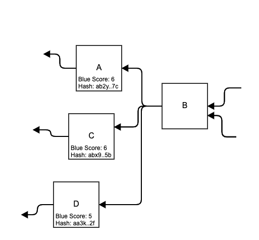

# Selected Parent

The selected parent of a [block](../blocks/) is the block's [parent](../blockdag/past.md#previous-blocks-parents) with the highest [blue score](blue-score.md).

If there is a tie, then the selected parent block is the one with the lowest [hash](../serialized-data-formats/hash.md).

In the example below, both block A and C have the same blue score, but block A’s hash is lower, therefore block B’s selected parent block is block A.

## Selected Tip of the BlockDAG

The selected tip of a [blockDAG](../blockdag/) is its [tip](../blockdag/tips.md) with the highest [blue score](blue-score.md).

