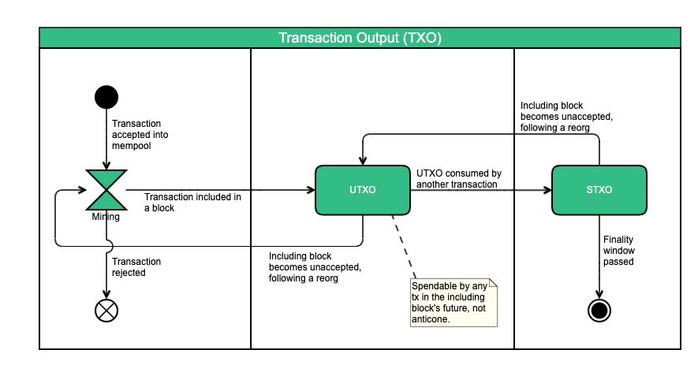

# Transaction Output \(TXO\)

"TXO" stands for "transaction output". Each [transaction](../transactions/) consumes one or more [inputs](../transactions/#Transaction-Inputs-1) and produces one or more [outputs](../transactions/#Transaction-Outputs). The inputs are references to unspent outputs \([UTXOs](utxo.md)\) of previous transactions. The inputs must be valid \(i.e., exist in the [UTXO set](https://daglabs.atlassian.net/wiki/spaces/SPEC/pages/682328425/UTXO+Set) of the [past](https://daglabs.atlassian.net/wiki/spaces/SPEC/pages/594477229/Past) of the transaction's [block](../blocks/)\).


A UTXO cannot be partially consumed. The sum of all the UTXOs a transaction consumes must be greater or equal to the sum of the new outputs it produces. The remainder, if there is any, constitutes the [fee](../transactions/coinbase-transaction.md) that the transaction creator offers miners for including it in a block.

## Lifecycle <a id="Lifecycle"></a>

A TXO is consumed and produced by transactions. It exists for [accepted transactions](../consensus/accepted-transactions.md). Once it exists, it is first unspent \(UTXO\), until it is spent \([STXO](stxo.md)\) in another transaction. It may become unspent again, during a [reorg](../consensus/reorganization-of-the-blockdag-reorg.md).



## Serialized Format <a id="Serialized-Format"></a>

A serialized transaction output is comprised of the fields of the following table, in the order they appear in the table, and with the types described in the table.‌

Kaspa transaction outputs are the same as [Bitcoin transaction outputs](https://bitcoin.org/en/glossary/output), except that they are uint64 instead of int64.

| **Field Name** | **Type** | **Size in bytes** | **Description** |
| :--- | :--- | :--- | :--- |
| value | uint64 | 8 | Amount in Sompis |
| scriptPubKeyLen | [VarInt](https://daglabs.atlassian.net/wiki/spaces/SPEC/pages/144048451/VarInt) | variable | The length of the script pub key |
| scriptPubKey | \[\]byte | scriptPubKeyLen | A script that the redeemer must meet in order to spend the value |

### Example <a id="Example"></a>

`9C 93 08 2A 01 00 00 00 19 76 A9 14 12 34 E3 08 0B BD 41 35 CA 3B 33 0F DC 42 69 9F 29 97 CD C0 88 AC`

### Breakdown <a id="Breakdown"></a>

```text
9C 93 08 2A 01 00 00 00  --  value
19                       --  scriptPubKeyLen (25)
76 A9 14 12 34 E3 08 0B  
BD 41 35 CA 3B 33 0F DC 
42 69 9F 29 97 CD C0 88 
AC                       --  scriptPubKey
```

