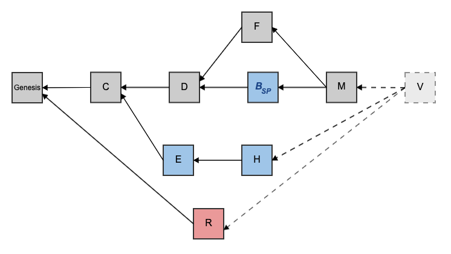
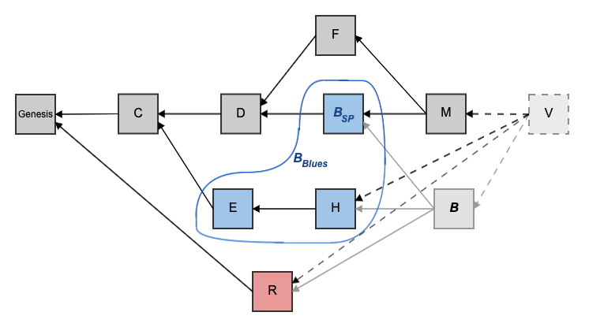
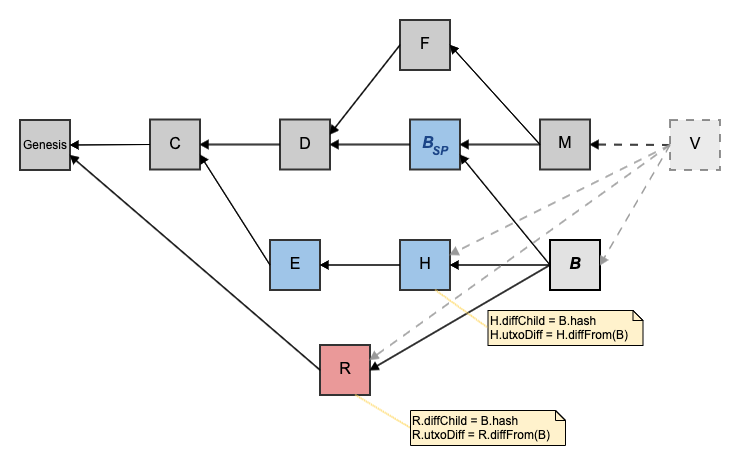
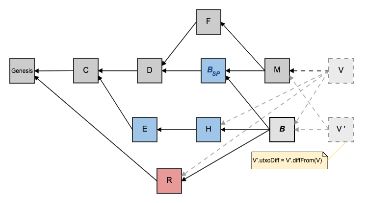
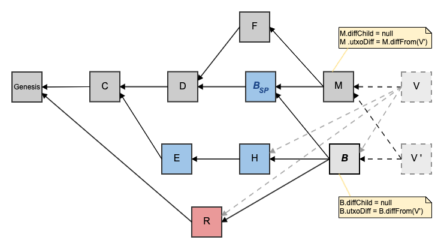
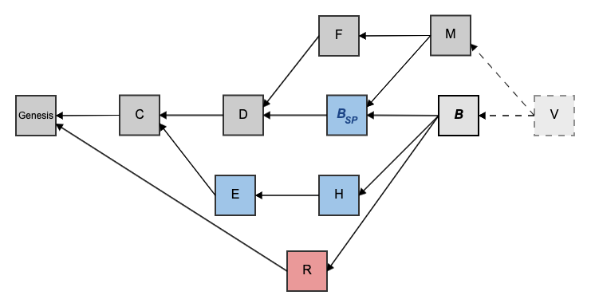

# UTXO Diffs

A UTXO diff of a [block](../../blocks/) B is the information needed to obtain B's [UTXO set](../utxo-set/) from the UTXO set of B's [diff child](diff-child.md).

UTXO diffs are commutative, meaning they can be added and subtracted.

A UTXO diff is implemented as two [UTXO collection](../utxo-set/utxo-collection.md) objects:

1. `diffToAdd` - a UTXO collection object containing the difference needed to add to the source UTXO set in order to get to the destination UTXO set.
2. `diffToRemove` - a UTXO collection object containing the difference needed to remove from the source UTXO set in order to get to the destination UTXO set.

## Motivation

Kaspa uses the UTXO model, like in Bitcoin. [Full nodes](../../../glossary.md#full-node) maintain a current state of the [UTXO set](../utxo-set/). There are times when a node needs to know what the the UTXO set looked like at a historical moment, e.g. when needing to validate a block from its point of view at the time it was created. Thus a node needs to be able to [restore the UTXO set](./#Restoring-the-UTXO-Set-of-a-Block) to any moment until finality. Since the UTXO set in Kaspa can grow quite large and is frequently changing with its high transaction throughput, it is wasteful to save a full copy of the UTXO set for each block.

## Solution <a id="Solution"></a>

The solution involves having two implementations of UTXO set objects:

* \*\*\*\*[Full UTXO Set](../utxo-set/full-utxo-set.md) - a full copy of the UTXO set of the [virtual block](../../../glossary.md#virtual-block)
* [Diff UTXO Set](../utxo-set/diff-utxo-set.md) - a diff from the [full UTXO set](../utxo-set/full-utxo-set.md), saved for each block, other than the virtual block

## Diff Algebra <a id="Diff-Algebra"></a>

We define the following two operations:

```text
set.diffFrom(set) = diff
set.withDiff(diff) = set
```

Let A and B be UTXO sets with the same `base`.

And let c be the difference in UTXO set of A from B.

```text
A.diffFrom(B) = c
A.withDiff(c) = B
```

When using `A.diffFrom(B)`, the `base` part of A and B has to be the same, otherwise it will panic.  
When using `A.withDiff(c)`, the resulting UTXO set, B, will have the same `base` as A.

The order matters. `A.diffFrom(B)` will return a diff c, that if applied to A will give B, and not the other way around. `B.diffFrom(A)` will return a different diff c', that if applied to B will give A.

## Melding to Base

This method replaces the [full UTXO set](../utxo-set/full-utxo-set.md) with a [diff UTXO set](../utxo-set/diff-utxo-set.md).

```text
Diff_UTXO_Set.meldToBase
```

Let V' be the diff UTXO set of a new virtual block from the current virtual block.

This method replaces the full UTXO set of the current virtual block with that of V'.

```text
V’.meldToBase
```

## Restoring the UTXO Set of a Block <a id="Restoring-the-UTXO-Set-of-a-Block"></a>

### Motivation <a id="Motivation.1"></a>

Being able to restore the UTXO set of a block plays a crucial part in validating a block. In order to validate a block’s transactions, all of the inputs consumed by each of its transactions must have existed in the UTXO set of said block at the time it was created.

Future blocks could annul some or all of those transactions, but that does not invalidate the block. For the block to be valid, all its transactions must have been valid from the point of view of that block’s [past](../../blockdag/past.md).

### Method <a id="Method"></a>

Each block in the [DAG](../../blockdag/) has a route of [diff children](diff-child.md) from itself to the [virtual block](../../blockdag/virtual-block.md). As mentioned, UTXO diffs are commutative. In order to restore the UTXO set of block B, the path of diff children from B to the virtual block, V, is traversed, stacking references to the blocks along that route. Once reaching the virtual block, the diff children are popped from the stack and their UTXO diffs are accumulated. This way, a cumulative UTXO diff is built containing the difference between the UTXO of B and that of the virtual block. The UTXO Set of B is then defined as a diff UTXO set:

```text
restoreUTXO(block B) = 
  B.diffFrom(V) = [base: *Full_UTXO_Set(V), diff: Agregation_of(UTXO_Diffs from V to B)]
```

Likewise, the same algorithm can be applied generically to acquire the UTXO diff between any block A and a block in its future B.

```text
UTXO Diff of A from B = 
  A.diffFrom(B.diffFrom(V)) =
    A.diffFrom(V) = [base: *Full_UTXO_Set(V), diff: Sum_of(UTXO_Diffs from V to A)]
  - B.diffFrom(V) = [base: *Full_UTXO_Set(V), diff: Sum_of(UTXO_Diffs from V to B)]
```

## Adding a New Block <a id="Adding-a-New-Block"></a>

### UTXO and Accepted Transactions Commitments <a id="UTXO-and-Accepted-Transactions-Commitments"></a>

When a new block B is added, its diff UTXO set is calculated in the following way:

1. Restore the UTXO set of B’s [selected parent](../../consensus/selected-parent-chain.md).
2. Iterate over the blocks in B's [merged blocks](../../consensus/merged-blocks.md) in [PHANTOM order](../../consensus/) \(B’s selected parent first then the rest of B’s merged blocks in PHANTOM order\). For each block in B's merged blocks:
   1. Iterate over transaction included in the block. For each transaction T:
      1. If and only if all of T’s inputs are available in the restored UTXO Set:
         1. Subtract the outputs referenced by the inputs \(by [transaction ID](../../transactions/#Transaction-ID) and [Index](../outpoint.md)\) from the UTXO set. _We do this because the inputs do not contain the same fields as the outputs, and when calculating the UTXO commitment of block B, we want to hash the fields in output._
         2. Add T’s outputs to the UTXO set.
         3. Mark that transaction as [accepted](../../consensus/accepted-transactions.md) by block B.
      2. Otherwise \(i.e., if at least one of the inputs are not in the UTXO set\):
         1. Ignore that transaction and continue to the next one.
         2. Do not add it to the accepted transactions of block B
         3. Do not remove any of its inputs from the UTXO set and do not add any of its outputs to the UTXO set.

### Updating Diff Children and Virtual <a id="Updating-Diff-Children-and-Virtual"></a>

Once a new block B is added, the UTXO set of virtual V is updated in the following way:

1. Create a diff child and UTXO diff for each of B’s parents that do not have a diff child yet.
2. Instantiate a new virtual block V', pointing to B and other [tips](../../blockdag/tips.md) \(parents of V\) as [parents](../../blockdag/past.md#previous-blocks-parents).
3. [Restore](./#Restoring-the-UTXO-Set-of-a-Block) the UTXO set of V' as a diff UTXO set from V.
4. Update the diff child and UTXO diff of all new tips \(parents of V'\), using diff algebra, e.g. tip\_i.diffFrom\(V'\).
5. Perform the switch between V and V', using V’.meldToBase; it is a destructive operation that will overwrite the full UTXO set with the diff UTXO set of V'.

## Example <a id="Example"></a>



Say a node wants to add block B to the above DAG_._ It needs to restore B's UTXO set, to figure out if its transactions are consistent with the UTXO set at the time B was created.



First, the node restores the UTXO set of B’s [selected parent](../../consensus/selected-parent-chain.md), denoted B\_SP.

Then it attempts to add transactions from B's [merged blocks](../../consensus/merged-blocks.md) according to [PHANTOM](../../consensus/) order, i.e., first transactions from B\_SP, then transactions from E, and finally from H \(note that we assume [k](../../consensus/parameters.md#k)=3 and thus R is not in B's blue merged blocks\). For each transaction attempted to be added, if all its inputs point to outputs that are available in the UTXO set, then the transaction is accepted, the outputs it spends are removed from the UTXO set and the outputs it produces are added to the UTXO set.

Lastly, it attempts to add B's own transactions. They all need to consume outputs that are available in the UTXO set that was reached in the previous step.

Note that B can include transactions that double spend inputs of transactions in R. The current implementation completely ignores red blocks.

Once the node has determined that block B can be added, the next step is to create a diff child and UTXO diff for each of B’s parents that do not have a diff child yet. Those are blocks H and R, whose diff child was _null_ since they were previously only pointed at by the virtual block.



The next step is to create a new virtual block V' that points to B and other tips. The parents of V' are blocks B and M. Then, the UTXO set of V' is restored.



First, the node restores the UTXO set of V's selected parent – block B.

Block B has six blue blocks in its past, while M has five, hence the selected parent of V' is B.

Then the node attempts to add transactions from the merged blocks of V' according to PHANTOM order, i.e. first transactions from B, then transactions from M. For each transaction attempted to be added, if all its inputs point to outputs that are available in the UTXO set, then the transaction is accepted, the outputs it spends are removed from the UTXO set and the outputs it produces are added to the UTXO set.

Note that once B was added, M moved out of the selected parent chain, and B moved into the selected parent chain.

Once V' is added, the node updates the diff child and UTXO diff of all new tips \(parents of V'\), using diff algebra.



The last step is to perform the switch between V and V', using V’.meldToBase.


Or more nicely, by arranging the blocks so that the selected parent chain is a straight chain in the middle, we get:



