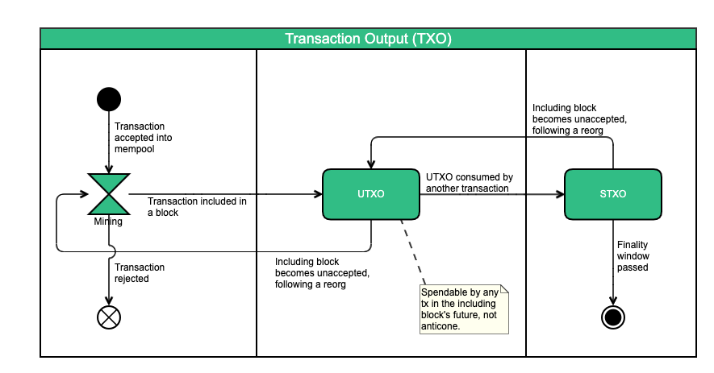

# UTXO

"UTXO" stands for "unspent transaction output".

A UTXO is created once a [transaction is included in a block](../transactions/transactions-including-blocks.md). It is then consumable \(spendable\) by any transaction in any block in the [future](../blockdag/future.md) of its including block. Once a transaction spends a UTXO, that UTXO is considered an [STXO](stxo.md) and is removed from the [UTXO set](utxo-set/).

